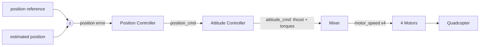

# Control Systems & PID

## What a control system is

A **control system** exists to **change (regulate) the behavior** of a device, machine, or process — the thing being regulated is called the **plant**. The plant might be an air-conditioner, a chemical process, an iron, or a robot. In every case the plant produces an **effect**: a room temperature, a flow rate, or the motion of a robot arm. To do its job the controller relies on **sensors** (a thermostat, a flow meter, a potentiometer + encoder) to **measure the plant's response**, and then acts on the plant to drive its output toward the **desired** value.

- **Plant** — the system being controlled (its internal details may be unknown; only its input→output relation matters).
- **Controller** — takes the plant's measured output as *its* input and, based on its design, computes the command that pushes the output toward the reference.
- **Reference / setpoint `r`** — the desired value we want the output to reach.
- **Output `y`** — the actual, measured/estimated plant response.

There is a difference in the *nature* of regulation. In an air-conditioner or iron the controller regulates a steady **output level**. In a robot the controller **tracks a moving reference** (a commanded trajectory) and controls its specifications — position, velocity, orientation. Tracking-type control of motion is called a **servo control system**.

**Purpose for a robot.** A controller makes the robot follow a desired behavior. It compares the **desired** (reference) with the **measured/estimated** value; the difference is the **error**, which it converts into a command. The whole job is to drive `e(t) → 0`.

## Open-loop vs closed-loop (feedback)

**Open-loop** applies a command *without measuring the output*. It works only if the model is exact and there are no disturbances — it **cannot reject wind, payload change, or model error**. There is no way for it to notice it is going wrong.

**Closed-loop (feedback)** measures the output, forms the error, and corrects continuously. The feedback cycle each tick is:

    measure y → compute e = r − y → compute u → apply u → repeat

In a closed-loop controller the controller receives a signal that indicates the plant's *response* to the previous command. If the motion is not as desired, the controller increases or decreases the command to **force** the plant to behave as desired.

## The error signal and why feedback is subtracted

At the **summing junction** the feedback signal is **subtracted** from the reference, producing the **error signal** `e = r − y`. The error is the **driving signal** for the controller.

The subtraction is not cosmetic — it is what makes the loop **stable** (this is **negative feedback**). If the feedback were *added* instead, the combined signal would grow as the output grows, which further increases the output, which increases the signal again... until the system **runs away / "overflows."** Negative feedback instead shrinks the error: as `y` approaches `r`, `e → 0` and the corrective command fades out.

**Why feedback is needed:** open-loop can't reject disturbances. **Why PID depends on good sensing:** it acts on the **estimated** state from [Sensors & State Estimation](state-estimation.md) — a bad estimate means it corrects toward the wrong place.

## Block diagrams & transfer functions (conceptually)

A **block diagram** is the picture of a control system. It lets us visualize the relationships between the plant, signals, controller, and feedback loop. The simplest block represents a system by its **input and output**; the *actual internals are not shown* — only the **equation relating input to output**. As long as that relation is known, the block's details are unnecessary for analysis. Block diagrams also show **how signals flow** between elements, and from them we derive the governing equations.

A **transfer function** is the equation giving the **ratio of output to input** of a block or of a whole system. With reference `R(s)`, output `Y(s)`, forward dynamics `G(s)` (system + controller), and feedback multiplier `H(s)`:

- Error: `E(s) = R(s) − H(s)·Y(s)`
- Output: `Y(s) = G(s)·E(s)`
- **Closed-loop transfer function:** `Y(s)/R(s) = G(s) / (1 + G(s)·H(s))`

That `1 + G·H` denominator is the signature of a closed feedback loop; for **unity feedback** `H = 1`.

**Block-diagram simplification** reduces a tangle of blocks to a single equivalent transfer function using standard transformations: **series** blocks multiply (`G₁·G₂`), **parallel** blocks add (`G₁ + G₂`), a **feedback loop** collapses to `G/(1 + GH)`, and summing junctions / pickoff points can be moved across blocks as long as the input→output relation is preserved. The point is to obtain one overall `Y/R` for analysis.

**Industrial-robot block diagram.** A real robot joint is exactly this structure: a **reference** joint angle enters a summing junction, the **encoder/potentiometer** feeds the measured angle back to be subtracted, the **error** drives the **controller**, which commands the **actuator (motor + gearing = the plant)**, whose output is the joint motion — measured again to close the loop. A multi-joint robot is many such loops, often **nested** (see cascade control below).

## The PID controller

PID converts the error into a command using **three intuitive actions**, reacting to the **present, the past, and the rate** of the error:

    u(t) = Kp·e(t) + Ki·∫e(τ)dτ + Kd·(de/dt)

| Term | Reacts to | Effect | Danger if too large |
|------|-----------|--------|---------------------|
| **P** (Proportional) | the **present** error | fast response | leaves **steady-state error**; oscillation |
| **I** (Integral) | **accumulated past** error | **removes steady-state error** | overshoot / windup |
| **D** (Derivative) | the **rate of change** of error | **damps** overshoot / oscillation | **amplifies sensor noise** |

**Why P alone leaves steady-state error.** Proportional action needs *some* error to produce output — its command is literally proportional to `e`. If the error reached zero the P command would vanish, but holding the output against a constant load (gravity, friction) requires a non-zero command, so the system settles at a small residual error where `Kp·e` balances the load. The integral term fixes this: it keeps accumulating the residual error until the command is large enough to close the gap, then holds it.

### Integrator windup & anti-windup

If the error stays large for a long time — typically because the actuator is **saturated** (commanding more than the motor can deliver) — the integral term keeps accumulating even though the extra command has no effect. When the setpoint is finally reached, that bloated integral causes a large **overshoot** before it unwinds. **Fix (anti-windup):** clamp the integral to a band `I = clip(∫e dt, −I_max, +I_max)`, and/or **stop integrating while the output is saturated**.

### Derivative noise & derivative-on-measurement

D **differentiates the error**, so it **amplifies high-frequency sensor noise** into jittery commands. Two standard remedies: **low-pass filter** `de/dt`, and compute D from `−d(y)/dt` (**derivative-on-measurement**) rather than `d(e)/dt`. The latter also removes the **"derivative kick"** — the spike that occurs when the setpoint changes stepwise (a step in `r` makes `de/dt` momentarily infinite, but `y` is smooth).

### Feed-forward (the m·g gravity term)

**Feed-forward** is a term added *before any error appears*, to pre-compensate a **known** load. For altitude hold the `m·g` term is **gravity feed-forward**: at hover (`e = 0`) the command is already `m·g`, so PID only has to **trim the residual** rather than build up the entire hover command through its integrator. Feed-forward handles the predictable part; feedback cleans up the rest.

### Discrete implementation (in words)

On a real robot the loop runs at a fixed rate `Δt`. Each tick: form the error `e_k = r_k − y_k`; **accumulate** the integral by adding `e_k·Δt` to the running sum (the discrete `∫`); **approximate the derivative** as the difference `(e_k − e_{k−1})/Δt`; then combine as `u_k = Kp·e_k + Ki·I_k + Kd·ė_k`. The integral is a running accumulator and the derivative is a backward difference — both depend on `Δt`, so the loop rate must be steady. Typical loop rates: **attitude 500–1000 Hz, position 50–200 Hz**.

### Gain-effect cheat sheet & common faults

| Increase | Rise time | Overshoot | Steady-state error |
|----------|-----------|-----------|--------------------|
| `Kp` | ↓ | ↑ | small ↓ |
| `Ki` | small ↓ | ↑ | **eliminated** |
| `Kd` | small ↓ | **↓** | small change |

- Oscillation / overshoot → `Kp` too high → lower `Kp`, raise `Kd`.
- Windup → `Ki` too high / no clamp → clamp integral, lower `Ki`.
- Sluggish / large offset → raise `Kp` or `Ki`.
- Jittery output → `Kd` too high / noisy sensor → lower `Kd`, filter the derivative.

### Ziegler–Nichols tuning

A practical starting point. Set `Ki = Kd = 0` and raise `Kp` until the output shows **sustained, constant-amplitude oscillation**; record the **critical gain `Kp,crit`** and oscillation **period `T_osc`**. Then set `Kp = 0.6·Kp,crit`, `Ki = 1.2·Kp,crit / T_osc`, `Kd = 0.075·Kp,crit·T_osc`. These are a baseline to refine, not a final answer.

## Quadcopter example — altitude hold

For `z_ref = 10 m`, the vertical command is gravity feed-forward plus PID trim:

    thrust = m·g + Kp·e + Ki·∫e + Kd·ė

The `m·g` term holds altitude even at zero error; PID corrects the rest. Raising `Kp` → climbs faster but may overshoot; adding `Ki` → eliminates the residual gap below 10 m; adding `Kd` → smooths the approach. Without `m·g`, PID would need a *permanent* error to hold altitude.

## Cascade control (inner/outer loops)

The outer **position loop** (slow, 50–200 Hz) sets the desired attitude/thrust; the inner **attitude loop** (fast, 500–1000 Hz) achieves it; the **mixer** converts thrust + torques into 4 individual motor speeds. **Rule of thumb: the inner loop should run 5–10× faster than the outer loop** — so the inner loop looks "instantaneous" to the outer one, keeping the cascade stable. The attitude loop is itself **three independent PIDs** producing roll/pitch/yaw torques `τ_φ, τ_θ, τ_ψ`. This nesting is the multi-loop industrial-robot block diagram applied to a drone.

## Mixer / motor allocation

The mixer maps the 4 control commands (total thrust `F` + 3 torques) to the 4 rotor squared-speeds by **inverting the allocation matrix** `M` (entries depend on arm length `l`, thrust coefficient `k_T`, drag coefficient `k_D`):

    [ω₁², ω₂², ω₃², ω₄²]ᵀ = M⁻¹ · [F, τ_φ, τ_θ, τ_ψ]ᵀ

## Quadrotor dynamics (what control acts on)

- **6 DoF** (3 position + 3 orientation) but only **4 actuators** → **underactuated**: it must **tilt to translate** because thrust always points along body-z. The 4 independent inputs are **total thrust + roll + pitch + yaw torque**. (This underactuation is the controllability concern of [State-Space Modeling](state-space.md).)
- **Rotor → force/torque:** thrust per rotor `F_i = k_T·ω_i²`; reaction (drag) torque `τ_i = k_D·ω_i²`. Total thrust `F = k_T·Σω_i²`. Roll/pitch come from **opposite-rotor speed differences** (`τ_φ, τ_θ ∝ l·k_T·Δω²`); yaw comes from the **CW vs CCW pair imbalance** (`τ_ψ ∝ k_D·Δω²`). Adjacent rotors spin in opposite directions so their reaction torques cancel in hover.
- **Four maneuvers:** climb = all rotors ↑ equally; roll = right vs left; pitch = front vs back; yaw = CW pair vs CCW pair.
- **Translational EOM** (thrust projected through the current attitude — *this is why attitude control enables position control*): `m·ẍ = (…)·F`, `m·ÿ = (…)·F`, `m·z̈ = −mg + (cosθ·cosφ)·F`.
- **Rotational EOM** (Euler): `φ̈ = [τ_φ − (I_yy − I_zz)·q·r] / I_xx` (and cyclic for θ, ψ). The cross terms are **gyroscopic coupling**, small near hover.
- **Hover condition:** `T = m·g`. Climbing: `T = mg + m·a_z + D` (weight + inertia + drag).
- **Validity:** PID is a **linear** controller, valid **near hover**; at large angles the nonlinear coupling grows. **Beyond PID:** LQR, MPC, backstepping. (X-configuration blends two rotors per axis for more torque authority; +-configuration drives each axis with a single arm.)

## Failure modes

- **Wrong gains** → oscillation (too much P), noise-driven jitter (too much D), or sluggish drift (too little I).
- **Saturation + no anti-windup** → big overshoot after the setpoint is reached.
- **Acts on the estimate, not truth** → a bad estimate ⇒ bad tracking even with perfect gains; the controller faithfully drives toward the *wrong* place.
- **Infeasible reference** → if [Trajectory Generation & Tracking](trajectory.md) hands it an over-aggressive trajectory, the controller saturates and can't keep up.

## Related

- [Sensors & State Estimation](state-estimation.md) — supplies the estimated state `x̂` the controller acts on.
- [Trajectory Generation & Tracking](trajectory.md) — produces the feasible reference the controller tracks.
- [State-Space Modeling](state-space.md) — the plant model (observability/controllability, underactuation) behind control.
- [System Integration & Robustness](integration-robustness.md) — saturation monitoring, stale data, and fail-safe handling around the loop.
- [The Autonomy Stack](../foundations/autonomy-stack.md) — where control sits among the acting blocks.
- [Mechanical Configuration & Actuation](../hardware/mechanical-configuration.md) — the motors/mixer the controller commands.
