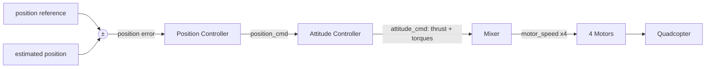

# Control Systems & PID

## Core terms

- **Plant** — system being controlled; only its input→output relation matters.
- **Controller** — turns error into a command driving output toward reference.
- **Reference `r`** — desired value. **Output `y`** — measured/estimated response.
- **Servo control** — tracking a *moving* reference (robot motion), vs regulating a steady level (thermostat).
- Goal: drive `e(t) → 0`.

## Open vs closed loop

- **Open-loop** — command without measuring; works only with exact model + no disturbances. Can't reject wind/payload/model error.
- **Closed-loop** — `measure y → e = r − y → compute u → apply u → repeat`.
- **Negative feedback** — feedback **subtracted** at the summing junction. Subtraction is what makes it stable: as `y → r`, `e → 0`. Adding feedback instead → runaway.
- PID acts on the **estimated** state from [Sensors & State Estimation](state-estimation.md); bad estimate → corrects toward the wrong place.

## Block diagrams & transfer functions

- **Block** — input→output relation only; internals hidden.
- **Transfer function** — output/input ratio. With forward `G(s)`, feedback `H(s)`:
  - `E(s) = R(s) − H(s)·Y(s)`, `Y(s) = G(s)·E(s)`
  - **Closed-loop:** `Y/R = G / (1 + G·H)` (unity feedback `H = 1`).
- **Simplification rules:** series multiply `G₁·G₂`, parallel add `G₁ + G₂`, feedback collapses to `G/(1 + GH)`.
- **Robot joint** = one loop: reference angle → summing junction → error → controller → actuator (motor+gearing = plant) → encoder feeds back. Multi-joint = many nested loops.

## PID controller

    u(t) = Kp·e + Ki·∫e dτ + Kd·(de/dt)

| Term | Reacts to | Effect | Danger if large |
|------|-----------|--------|-----------------|
| **P** | present error | fast response | steady-state error; oscillation |
| **I** | accumulated past | removes steady-state error | overshoot / windup |
| **D** | rate of error | damps overshoot | amplifies sensor noise |

- **P alone leaves steady-state error** — its command vanishes at `e = 0`, but holding against gravity/friction needs nonzero command, so it settles at residual where `Kp·e` = load. I accumulates that residual until the gap closes.

### Gotchas

- **Integrator windup** — actuator saturates, integral keeps growing uselessly → big overshoot on arrival. **Fix:** clamp `I = clip(∫e, −I_max, I_max)` and/or stop integrating while saturated.
- **Derivative noise** — D amplifies HF noise → jitter. **Fix:** low-pass `de/dt`; compute D from `−d(y)/dt` (**derivative-on-measurement**), which also kills **derivative kick** on stepwise setpoint changes.
- **Feed-forward** — added before any error to pre-compensate a known load (e.g. gravity `m·g`). At hover (`e=0`) command is already `m·g`; PID only trims residual.

### Discrete loop

Each tick `Δt`: `e_k = r_k − y_k`; integral `I_k += e_k·Δt`; derivative `(e_k − e_{k−1})/Δt`; `u_k = Kp·e_k + Ki·I_k + Kd·ė_k`. Loop rate must be steady. Typical: **attitude 500–1000 Hz, position 50–200 Hz**.

### Gain-effect cheat sheet

| Increase | Rise time | Overshoot | Steady-state error |
|----------|-----------|-----------|--------------------|
| `Kp` | ↓ | ↑ | small ↓ |
| `Ki` | small ↓ | ↑ | **eliminated** |
| `Kd` | small ↓ | **↓** | small change |

- Oscillation/overshoot → `Kp` too high → lower `Kp`, raise `Kd`.
- Windup → clamp integral, lower `Ki`.
- Sluggish/offset → raise `Kp` or `Ki`.
- Jitter → lower `Kd`, filter derivative.

### Ziegler–Nichols

Set `Ki=Kd=0`, raise `Kp` to sustained oscillation → record critical gain `Kp,crit` and period `T_osc`. Then `Kp = 0.6·Kp,crit`, `Ki = 1.2·Kp,crit/T_osc`, `Kd = 0.075·Kp,crit·T_osc`. Baseline only.

## Quadcopter altitude hold

    thrust = m·g + Kp·e + Ki·∫e + Kd·ė

`m·g` holds altitude at zero error; PID trims the rest. Without `m·g`, PID needs permanent error to hover.

## Cascade control

- Outer **position loop** (slow, 50–200 Hz) sets desired attitude/thrust; inner **attitude loop** (fast, 500–1000 Hz) achieves it.
- **Rule of thumb: inner loop 5–10× faster than outer** → looks instantaneous, keeps cascade stable.
- Attitude loop = three independent PIDs → roll/pitch/yaw torques `τ_φ, τ_θ, τ_ψ`.

## Mixer / motor allocation

Maps 4 commands (thrust `F` + 3 torques) to 4 rotor squared-speeds by inverting allocation matrix `M` (depends on arm `l`, thrust coef `k_T`, drag coef `k_D`):

    [ω₁², ω₂², ω₃², ω₄²]ᵀ = M⁻¹ · [F, τ_φ, τ_θ, τ_ψ]ᵀ

## Quadrotor dynamics

- **6 DoF, 4 actuators → underactuated**: must **tilt to translate** (thrust along body-z). Inputs = thrust + 3 torques. (Controllability concern of [State-Space Modeling](state-space.md).)
- **Rotor:** thrust `F_i = k_T·ω_i²`, drag torque `τ_i = k_D·ω_i²`. Roll/pitch ∝ `l·k_T·Δω²` (opposite-rotor diff); yaw ∝ `k_D·Δω²` (CW vs CCW imbalance). Adjacent rotors counter-rotate → reaction torques cancel.
- **Maneuvers:** climb = all ↑; roll = R vs L; pitch = F vs B; yaw = CW vs CCW pair.
- **Translational EOM:** `m·z̈ = −mg + (cosθ·cosφ)·F` (thrust projected through attitude — why attitude control enables position control).
- **Rotational EOM:** `φ̈ = [τ_φ − (I_yy − I_zz)·q·r]/I_xx` (cyclic). Cross terms = gyroscopic coupling, small near hover.
- **Hover:** `T = m·g`. Climb: `T = mg + m·a_z + D`.
- **Validity:** PID is linear, valid near hover; nonlinear coupling grows at large angles. **Beyond:** LQR, MPC, backstepping.

## Failure modes

- **Wrong gains** → oscillation (P), jitter (D), or drift (low I).
- **Saturation + no anti-windup** → overshoot on arrival.
- **Acts on estimate not truth** → bad estimate ⇒ bad tracking with perfect gains.
- **Infeasible reference** from [Trajectory Generation & Tracking](trajectory.md) → saturation, can't keep up.

## Related

- [Sensors & State Estimation](state-estimation.md) — supplies the estimated state `x̂` the controller acts on.
- [Trajectory Generation & Tracking](trajectory.md) — produces the feasible reference the controller tracks.
- [State-Space Modeling](state-space.md) — the plant model (observability/controllability, underactuation) behind control.
- [System Integration & Robustness](integration-robustness.md) — saturation monitoring, stale data, and fail-safe handling around the loop.
- [The Autonomy Stack](../foundations/autonomy-stack.md) — where control sits among the acting blocks.
- [Mechanical Configuration & Actuation](../hardware/mechanical-configuration.md) — the motors/mixer the controller commands.

## Handbook references
- *Underactuated Robotics* — [Acrobots, Cart-Poles, and Quadrotors](https://underactuated.csail.mit.edu/acrobot.html) · [Linear Quadratic Regulators](https://underactuated.csail.mit.edu/lqr.html) · [The Simple Pendulum](https://underactuated.csail.mit.edu/pend.html)
- *Robotic Manipulation* — [Manipulator Control](https://manipulation.csail.mit.edu/force.html)
