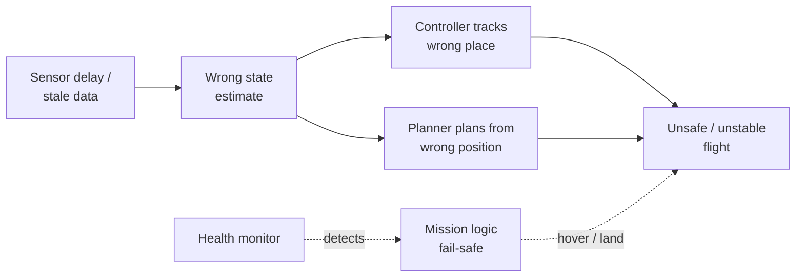

# System Integration & Robustness

Integration wires sensing/estimation/perception/planning/control/mission into one whole; robustness keeps it **safe when something breaks**. Supervisory layer over [The Autonomy Stack](../foundations/autonomy-stack.md).

## Where real failures come from

**Rarely the algorithm itself** — a correct planner/controller breaks on *connection*, not code:

- **delay** — result arrives too late
- **stale data** — old value used as current
- **frame mismatch** — wrong reference frame
- **inconsistent assumptions** — modules disagree on units/timing/validity
- **poor fallback** — nothing sensible when an input goes bad
- plus **jitter, dropped packets, controller saturation**

All **integration** failures, invisible to a module tested alone.

## Interfaces

Every module = inputs / outputs / assumptions. Principle: pass **confidence/health, not just nominal values** — a number with no trust measure is dangerous.

| Module | Inputs | Outputs | Assumes |
|--------|--------|---------|---------|
| **Estimator** | sensors, calibration, model | `x̂`, **covariance**, health | timestamps valid, model valid |
| **Planner** | map, goal, `x̂` | path, waypoints, constraints | valid map & pose |
| **Controller** | trajectory, `x̂` | actuator commands | **feasible** references |
| **Mission mgr** | health flags, battery, events | mode / task switch | meaningful thresholds |

Each module's **assumptions** = another's **outputs** (estimator assumes valid timestamps from sensing; controller assumes feasible references from trajectory). Robustness = honoring those contracts.

## Multi-rate timing

Blocks run at different rates (**IMU 100 Hz, estimator 50 Hz, planner 10 Hz, mission 1–2 Hz**). Data is read at a different rate than produced. A **correct control law on a stale estimate still commands unsafe corrections** — math right, timing wrong. Handle via timestamping, extrapolation, rejecting stale data.

## Frames

A state value needs all four: **value + timestamp + reference frame + uncertainty**. Frames: world/map, body, camera, local-nav. A bare "position = 3.2" is ambiguous. **A wrong frame transform is as dangerous as a wrong measurement** ([Coordinate Frames & Transforms](../geometry/coordinate-frames.md), [Perception](perception.md)).

## Key robustness ideas

- **Health monitoring** — watch every critical module's status.
- **Confidence/covariance** — propagate uncertainty so consumers weight/reject inputs.
- **Redundancy & cross-checking** — fuse/compare independent sources (GPS+vision+IMU); disagreement is itself a fault signal.
- **Watchdog timers** — no update in time → assume producer dead, act.
- **Saturation monitoring** — controller pinned at its limit = fault, not normal.
- **Graceful degradation** — degrade in **stages**, never perfect→dead: slow → widen margins → disable aggressive maneuvers → return-home → emergency land.

## Fault detection

Monitorable signals: **covariance growth** (estimator losing confidence), **confidence below threshold**, **control saturation**, **watchdog timeouts**. Goal: **stop a fault propagating downstream** before it hits actuators.

## Fail-safe vs fail-operational

| Concept | Meaning | Drone example |
|---------|---------|---------------|
| **Fail-safe** | fault → **safe state, stop** mission | lose critical sensor → hover / emergency land |
| **Fail-operational** | fault → **keep operating, degraded** | lose GPS → continue on IMU + camera |

Fail-safe prioritizes safety; fail-operational prioritizes mission continuity while still safe. Choice depends on criticality of the lost function and whether a safe degraded mode exists.

## Fault propagation

One upstream fault (stale data) **fans out** to corrupt control and planning, converging on unsafe flight; the **health monitor** detects it and triggers [Mission Logic & FSM](mission-fsm.md) to fail-safe first.

## Why nominal testing isn't enough

A system **passes every happy-path test and still fails on delay/degradation** — robustness is about the **unhappy paths**. Validate via **fault injection**: inject sensor dropout, stale map, comms delay, wind, low-battery, measure response. Metrics that matter:

- **time-to-detect**
- **time-to-safe-fallback**
- **recovery success** rate
- **tracking error under degradation**

These quantify *how the system fails* — the actual subject of robustness.

## Design checklist & common pitfalls

**Checklist:** expose confidence · monitor critical modules · distinguish nominal/degraded/emergency modes · define fallback explicitly · check interface assumptions (time, frame, units, feasibility) · validate with scenarios.

**Pitfalls:** assuming perfect sync · ignoring interface uncertainty · inconsistent frames · planner & controller designed independently · missing watchdogs · testing only the happy path.

## How "correct algorithm" changes meaning

A module provably correct **in isolation** still crashes on **stale data, wrong frame, or no fallback**. Correctness must be defined at the **integrated-system level, under uncertainty and degradation** — never "is this planner correct?" but "is this *system* safe when inputs are late, noisy, or wrong?"

## Related

- [Sensors & State Estimation](state-estimation.md) — covariance and health are the confidence signals integration relies on.
- [Mission Logic & FSM](mission-fsm.md) — the fail-safe decisions the health monitor triggers.
- [Coordinate Frames & Transforms](../geometry/coordinate-frames.md) — frame consistency; a wrong transform is as dangerous as a wrong measurement.
- [Perception](perception.md) — passing perception confidence across interfaces; silent obstacle misses.
- [Control Systems & PID](control-pid.md) — saturation monitoring; control on stale estimates is unsafe.
- [The Autonomy Stack](../foundations/autonomy-stack.md) — robustness supervises every block in the loop.

## Handbook references
- *Underactuated Robotics* — [Robust and Stochastic Control](https://underactuated.csail.mit.edu/robust.html) · [Output Feedback](https://underactuated.csail.mit.edu/output_feedback.html)
