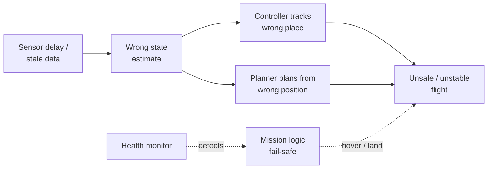

# System Integration & Robustness

**Purpose.** Good subsystems aren't enough — they must work together **reliably**. Integration connects sensing, estimation, perception, planning, control, and mission logic into one functioning whole, and robustness is what keeps that whole **safe when something goes wrong**. This is the supervisory layer over the entire [The Autonomy Stack](../foundations/autonomy-stack.md).

## Where real failures come from

The deep insight of this topic: **real failures are rarely the algorithm itself.** A provably correct planner or a well-tuned controller usually breaks because of how it is *connected*, not how it is written:

- **delay** — a result arrives too late to be useful;
- **stale data** — an old value is used as if it were current;
- **frame mismatch** — a quantity expressed in the wrong reference frame;
- **inconsistent assumptions** — two modules disagree about units, timing, or validity;
- **poor fallback logic** — nothing sensible happens when an input goes bad;
- plus **jitter, dropped packets, and controller saturation**.

Every one of these is an **integration** failure, invisible to a module tested in isolation.

## Interfaces

Every module has **inputs / outputs / assumptions**. The robustness principle is that interfaces must pass **confidence / health, not just nominal values** — a number with no measure of trust is dangerous because consumers cannot tell good data from garbage.

| Module | Inputs | Outputs | Assumes |
|--------|--------|---------|---------|
| **Estimator** | sensors, calibration, model | `x̂`, **covariance**, health | timestamps valid, model valid |
| **Planner** | map, goal, `x̂` | path, waypoints, constraints | valid map & pose |
| **Controller** | trajectory, `x̂` | actuator commands | **feasible** references |
| **Mission mgr** | health flags, battery, events | mode / task switch | meaningful thresholds |

Note how each module's **assumptions** are exactly another module's **outputs** — the estimator *assumes* valid timestamps that sensing must provide; the controller *assumes* feasible references that trajectory generation must guarantee. Robustness lives in honoring those contracts.

## Multi-rate timing

Real robots are **multi-rate**: different blocks run at different frequencies (e.g. **IMU 100 Hz, estimator 50 Hz, planner 10 Hz, mission logic 1–2 Hz**). This is unavoidable — fast inner loops, slow deliberative ones — but it means data is constantly being read at a different rate than it was produced. A **correct control law fed a stale position estimate can still command unsafe corrections**: the math is right, the timing is wrong. Handling multi-rate timing (timestamping, extrapolation, rejecting stale data) is a core integration job.

## Frames

A state value is only meaningful with **value + timestamp + reference frame + uncertainty** — all four. Typical frames: **world / map, body, camera, local-nav**. A bare number ("position = 3.2") is ambiguous until you know *when* it was valid, *in which frame* it is expressed, and *how trustworthy* it is. **A wrong frame transform is as dangerous as a wrong measurement** — transforming an obstacle into the wrong frame puts it in the wrong place just as surely as misdetecting it (a recurring theme in [Coordinate Frames & Transforms](../geometry/coordinate-frames.md) and [Perception](perception.md)).

## Key robustness ideas

- **Health monitoring** — continuously watch every critical module's status.
- **Confidence / covariance** — propagate uncertainty so consumers can weight or reject inputs.
- **Redundancy & cross-checking** — fuse or compare independent sources: GPS + vision + IMU; obstacle-map + camera; battery-voltage + energy-to-home. Disagreement is itself a fault signal.
- **Watchdog timers** — if an expected update doesn't arrive in time, assume the producer is dead and act.
- **Saturation monitoring** — a controller pinned at its limit is a fault indicator, not normal operation.
- **Fail-safe** and **fail-operational** (below).
- **Graceful degradation** — degrade in **stages**, never perfect → dead: slow down → widen margins → disable aggressive maneuvers → return-home → emergency land.

## Fault detection

Faults are caught via concrete, monitorable signals: **covariance growth** (the estimator losing confidence), **confidence below threshold**, **control-effort saturation**, and **watchdog timeouts**. The goal is always the same: **stop a fault from propagating downstream** before it reaches the actuators.

## Fail-safe vs fail-operational

| Concept | Meaning | Drone example |
|---------|---------|---------------|
| **Fail-safe** | on a fault → go to a **safe state** and **stop** the mission | lose a critical sensor → **hover** or **emergency land** |
| **Fail-operational** | on a fault → **keep operating in degraded mode** | lose GPS → **continue on IMU + camera** |

Fail-safe prioritizes **safety** (stop, get to a known-safe condition); fail-operational prioritizes **mission continuity while still safe** (keep going on reduced capability). The right choice depends on the criticality of the lost function and whether a safe degraded mode exists.

## Fault propagation

The diagram shows the core danger and the core defense: a single upstream fault (stale data) **fans out** to corrupt both control and planning, converging on unsafe flight — while the **health monitor** detects it and triggers [Mission Logic & FSM](mission-fsm.md) to intervene with a fail-safe before the unsafe state is reached.

## Why nominal testing isn't enough

A system can **pass every happy-path test and still fail on delay or degradation** — robustness is about the **unhappy paths** that nominal testing never exercises. Validation therefore requires **fault injection**: deliberately introduce sensor dropout, a stale map, comms delay, wind, or a low-battery event, and measure the response. And the metrics that matter are not just mission success but:

- **time-to-detect** — how long until the fault is noticed;
- **time-to-safe-fallback** — how long until the system reaches a safe state;
- **recovery success** rate;
- **tracking error under degradation**.

These quantify *how the system fails*, which is the actual subject of robustness.

## Design checklist & common pitfalls

**Design checklist:** expose confidence (not just nominal values) · monitor critical modules continuously · distinguish nominal / degraded / emergency modes · define fallback explicitly · check interface assumptions (time, frame, units, feasibility) · validate with scenarios, not one run.

**Common pitfalls:** assuming perfect synchronization · ignoring uncertainty at interfaces · inconsistent frames · planner and controller designed independently · missing watchdogs / timeouts · testing only the happy path.

## How "a correct algorithm" changes meaning in robotics

An algorithm provably correct **in isolation** can still crash if it runs on **stale data, in the wrong frame, or without a fallback**. In robotics, correctness cannot be a property of a single module on paper — **correctness must be defined at the integrated-system level, under uncertainty and degradation.** This reframes the whole discipline: the question is never "is this planner correct?" but "is this *system* safe when its inputs are late, noisy, or wrong?"

## Related

- [Sensors & State Estimation](state-estimation.md) — covariance and health are the confidence signals integration relies on.
- [Mission Logic & FSM](mission-fsm.md) — the fail-safe decisions the health monitor triggers.
- [Coordinate Frames & Transforms](../geometry/coordinate-frames.md) — frame consistency; a wrong transform is as dangerous as a wrong measurement.
- [Perception](perception.md) — passing perception confidence across interfaces; silent obstacle misses.
- [Control Systems & PID](control-pid.md) — saturation monitoring; control on stale estimates is unsafe.
- [The Autonomy Stack](../foundations/autonomy-stack.md) — robustness supervises every block in the loop.
