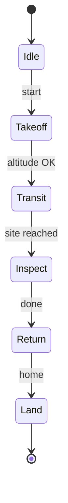
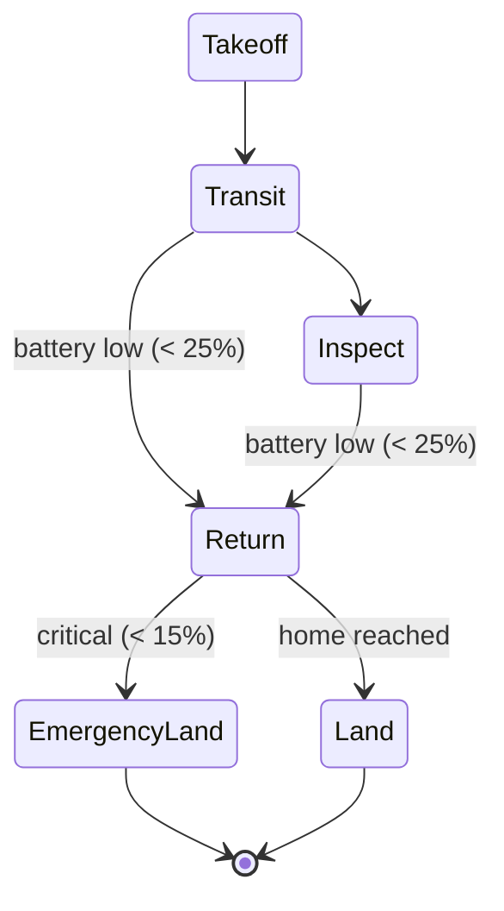
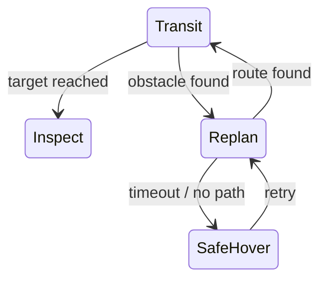

# Mission Logic & FSM

**Purpose.** Decide **what to do next** — not only *how to move*. Mission logic is the **discrete** decision layer that sits **above** [Planning & Navigation](planning.md) and [Control Systems & PID](control-pid.md): it chooses which mission phase the robot is in, while those lower blocks handle the continuous motion within a phase. The defining tension is that **mission logic is discrete even though the robot's dynamics are continuous** — a clean way to manage this split is described in [State-Space Modeling](state-space.md).

A **Finite State Machine (FSM)** models this discrete logic with:

- a set of **discrete states** (mission modes — Takeoff, Transit, Inspect, …),
- **transitions** between them,
- **events / guards** that trigger a transition (battery low, site reached, obstacle found),
- **actions** associated with each state (what the robot actively does while in it).

## Basic inspection mission FSM

## Why an FSM (and its limit)

Without an FSM the robot may keep running **outdated mission logic** — for example, flying toward a target it should already have abandoned. An FSM makes autonomy **explicit and verifiable**: you can see exactly when and why the system switches to Replan, Safe Hover, or Emergency Land, and you can reason about (or formally check) every transition. **Limit:** **state explosion** — as conditions multiply, the number of states and the web of transitions grows combinatorially, and FSMs become rigid and unwieldy for very complex or continuous decisions.

## Why planning alone isn't autonomy

A planner produces a **route**; it does **not** decide whether the mission should continue at all. Low battery, a hardware fault, or a newly discovered obstacle are not routing questions — they are **mission** questions. Decision-making sits **above** planning and control precisely so that something can say "stop planning toward that goal; come home instead." A robot that only plans will faithfully execute a doomed mission.

## Alternative — behavior trees

When the FSM's transition web explodes combinatorially, **behavior trees** are the common alternative. They replace explicit state-to-state transitions with **modular, reusable, reactive sub-trees** composed by **sequence / fallback / parallel** nodes. The reactivity and composability scale to complex behavior far better than a flat FSM, at the cost of a less immediately readable "where am I now" state.

---

## Worked examples (continuous + discrete recipe)

**The recipe:** (1) what evolves *continuously* → use a **state-space** model (see [State-Space Modeling](state-space.md)); (2) what changes *discretely* at the mission level → use an **FSM**; (3) connect both to planning, estimation, and control.

### Example 1 — Basic inspection mission

State-space: `x = [x, y, z, vx, vy, vz, ψ]ᵀ`. Inputs: thrust, lateral, and yaw commands. Outputs: GPS / IMU / altitude estimates. The FSM is exactly the basic inspection machine above. The continuous model says *how* the drone moves between sites; the FSM says *which phase* it is in.

### Example 2 — Low-battery reconfiguration

Extend the state with **battery**: `x = [x, y, z, vx, vy, vz, ψ, b]ᵀ`. Thresholds drive transitions:

- `b > 40%` → mission may continue;
- `b < 25%` → activate **Return-home**;
- `b < 15%` → **Emergency Land**.

Low battery is **both** a state-space variable (`b`) **and** a mission-state transition trigger — the bridge between the continuous and discrete worlds. **Response chain:** monitor detects threshold → FSM changes state → planner changes destination → trajectory generator makes a new reference → controller tracks it.

### Example 3 — Obstacle detected during transit

An obstacle's appearance affects **both** the continuous navigation state **and** the discrete mission state. Without an FSM the robot may keep using outdated logic; with one it **explicitly** switches Transit → Replan → (Safe Hover if planning fails) — making the failure handling visible and auditable.

### Example 4 — Poor tracking despite a good plan

The path is valid but the drone **oscillates**. Diagnose **block by block**:

1. **Bad trajectory** — geometrically valid but timing too aggressive (exceeds velocity / acceleration limits), so the controller saturates (see [Trajectory Generation & Tracking](trajectory.md)).
2. **Weak PID tuning** — too much P (oscillation) or too much D (noise amplification) (see [Control Systems & PID](control-pid.md)).
3. **Poor state estimation** — a delayed or noisy estimate gives the controller the *wrong feedback*, so it reacts to a state that isn't real (see [Sensors & State Estimation](state-estimation.md)).

**FSM role:** if tracking error grows too large, switch **Transit → Safe Hover** so that bad *control* does not escalate into unsafe *behavior*. The FSM is the safety net above a misbehaving continuous loop.

### Example 5 — Full mission architecture

Objective: take off, travel to target, inspect, return, and land safely. State: `x = [x, y, z, vx, vy, vz, ψ, b]ᵀ`. Block flow: Sensors → State estimation → Perception → Planning → Trajectory generation → Control → Robustness/monitoring → Mission logic. FSM states: `Idle, Takeoff, Transit, Inspect, Return, Land, Safe Hover, Emergency Land`. **Failure case:** battery goes critical during Transit → `b` drops past threshold → monitor detects → FSM transitions → Emergency Land / Return → planner re-targets → controller tracks the new reference. Every layer participates, but the **FSM is what makes the decision**.

## Related

- [State-Space Modeling](state-space.md) — the continuous model the FSM sits on top of; the continuous-vs-discrete recipe.
- [Planning & Navigation](planning.md) — produces routes; the FSM decides whether to plan/replan at all.
- [Control Systems & PID](control-pid.md) — executes motion within a state; the FSM can switch to Safe Hover when control degrades.
- [Sensors & State Estimation](state-estimation.md) — supplies the health/confidence and variables (battery, error) that trigger transitions.
- [System Integration & Robustness](integration-robustness.md) — health monitoring and fail-safe logic that drive mission transitions.
- [The Autonomy Stack](../foundations/autonomy-stack.md) — where mission logic sits as the top decision layer.
