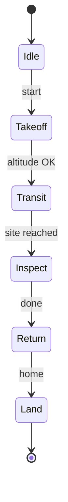
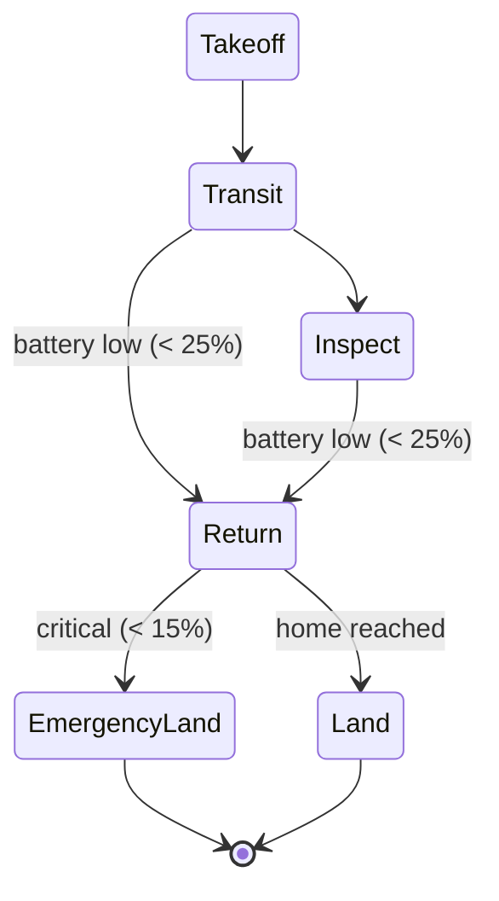
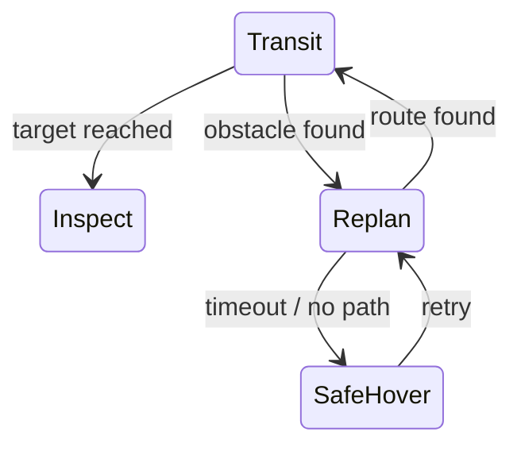

# Mission Logic & FSM

**Mission logic** = the **discrete** decision layer ("what to do next") above [Planning & Navigation](planning.md) and [Control Systems & PID](control-pid.md), which handle continuous motion within a phase. Core tension: **discrete logic over continuous dynamics** — managed via [State-Space Modeling](state-space.md).

**FSM** =
- **states** (mission modes — Takeoff, Transit, Inspect, …)
- **transitions** between them
- **events/guards** triggering a transition (battery low, site reached, obstacle found)
- **actions** per state (what it does while there)

## Basic inspection mission FSM

## Why an FSM (and its limit)

- Makes autonomy **explicit and verifiable** — see exactly when/why it switches to Replan, Safe Hover, Emergency Land; every transition is checkable.
- Without it, the robot runs **outdated logic** (flies toward an abandoned target).
- **Limit — state explosion:** states + transitions grow combinatorially; rigid and unwieldy for complex/continuous decisions.

## Why planning alone isn't autonomy

A planner produces a **route**, not whether the mission should continue. Low battery, faults, new obstacles are **mission** questions, not routing. Decision-making sits above so something can say "stop planning toward that goal; come home." Plan-only robots faithfully execute doomed missions.

## Alternative — behavior trees

When transitions explode, **behavior trees** replace state-to-state edges with **modular, reusable, reactive sub-trees** (sequence / fallback / parallel nodes). Better composability/reactivity at scale; cost is a less obvious "where am I now."

---

## Worked examples (continuous + discrete recipe)

**Recipe:** continuous evolution → **state-space** ([State-Space Modeling](state-space.md)); discrete mission changes → **FSM**; wire both to planning/estimation/control.

### Ex 1 — Basic inspection
`x = [x, y, z, vx, vy, vz, ψ]ᵀ`. Inputs: thrust/lateral/yaw. Outputs: GPS/IMU/altitude. Continuous = *how* it moves; FSM = *which* phase.

### Ex 2 — Low-battery reconfiguration
Add battery: `x = [x, y, z, vx, vy, vz, ψ, b]ᵀ`. Thresholds: `b>40%` continue · `b<25%` Return-home · `b<15%` Emergency Land.

`b` is both a state variable and a transition trigger — the continuous/discrete bridge. **Response chain:** monitor → FSM state change → planner re-targets → trajectory → controller tracks.

### Ex 3 — Obstacle during transit

Affects both continuous nav and discrete mission state. FSM explicitly switches Transit → Replan → (Safe Hover if planning fails) — failure handling visible/auditable.

### Ex 4 — Poor tracking despite good plan
Drone oscillates on a valid path. Diagnose block by block:
1. **Bad trajectory** — timing too aggressive (exceeds vel/accel limits) → controller saturates ([Trajectory Generation & Tracking](trajectory.md)).
2. **Weak PID** — too much P (oscillation) / too much D (noise) ([Control Systems & PID](control-pid.md)).
3. **Poor estimation** — delayed/noisy estimate → wrong feedback ([Sensors & State Estimation](state-estimation.md)).

**FSM role:** if tracking error grows, Transit → Safe Hover so bad *control* doesn't become unsafe *behavior*.

### Ex 5 — Full mission architecture
`x = [x, y, z, vx, vy, vz, ψ, b]ᵀ`. Flow: Sensors → estimation → perception → planning → trajectory → control → robustness → mission logic. States: `Idle, Takeoff, Transit, Inspect, Return, Land, Safe Hover, Emergency Land`. **Failure case:** battery critical in Transit → monitor → FSM transition → Emergency Land/Return → planner re-targets → controller tracks. Every layer participates; **FSM makes the decision.**

## Related

- [State-Space Modeling](state-space.md) — the continuous model the FSM sits on top of; the continuous-vs-discrete recipe.
- [Planning & Navigation](planning.md) — produces routes; the FSM decides whether to plan/replan at all.
- [Control Systems & PID](control-pid.md) — executes motion within a state; the FSM can switch to Safe Hover when control degrades.
- [Sensors & State Estimation](state-estimation.md) — supplies the health/confidence and variables (battery, error) that trigger transitions.
- [System Integration & Robustness](integration-robustness.md) — health monitoring and fail-safe logic that drive mission transitions.
- [The Autonomy Stack](../foundations/autonomy-stack.md) — where mission logic sits as the top decision layer.

## Handbook references
High-level task/mission logic (FSMs, behavior trees) is beyond the scope of these texts. Closest context:
- *Underactuated Robotics* — [Dynamic Programming](https://underactuated.csail.mit.edu/dp.html)
