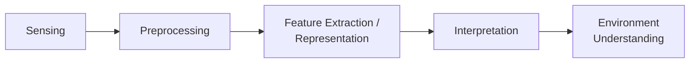

# Perception

Turns **raw sensor data into a structured world model**: obstacles, landmarks, free space, semantic labels, local/global maps. Answers **"what is around me?"** — vs [Sensors & State Estimation](state-estimation.md) which answers **"where am I?"**. Product is a world model, not a self-estimate.

## Pipeline

A **funnel**: high-bandwidth raw data in, low-bandwidth structured meaning out. **Planning consumes the structured output, not raw pixels** — a planner reasons over occupancy grids / cost maps / obstacle lists, which keeps the stack sensor-agnostic.

| Stage | What happens | Why it matters |
|-------|--------------|----------------|
| **Sensing** | acquire raw frames/scans | every downstream error inherits this noise/blur/occlusion |
| **Preprocessing** | denoise, calibrate, undistort, **time-sync** | bad timestamps / uncalibrated lens silently corrupt later stages |
| **Feature extraction** | edges, corners, **keypoints + descriptors**, occupancy cells | compresses raw data into matchable structures |
| **Interpretation** | obstacle/free/landmark labels; **detection / segmentation** | pixels become *meaning* |
| **Environment understanding** | fused world model to planning | the deliverable map the planner searches |

## Sensor modalities

| Modality | Gives | Weakness |
|----------|-------|----------|
| **Camera** | rich scene, color, texture, landmarks | blur, lighting, occlusion; no direct range |
| **LiDAR / ToF** | accurate range & 3D | noisy returns, cost, reflective/transparent, rain/dust |
| **Radar** | weather-robust range + **Doppler velocity** | low spatial resolution |
| **Depth / RGB-D** | per-pixel depth + color | short range, fails outdoors/sunlight |
| **Ultrasonic** | cheap short-range proximity | very short range, wide cone, poor angular res |

**Complementary fusion:** pair rich-but-fragile (camera) with robust-but-coarse (radar/LiDAR) → degrades gracefully.

## Representations and maps

| Representation | Stores | Best for |
|----------------|--------|----------|
| **Occupancy grid** | free/occupied **probability** per cell | 2D nav, cost maps |
| **Point cloud** | raw 3D points | LiDAR/depth, surface reconstruction |
| **Voxel / TSDF** | 3D occupancy / signed distance | dense 3D mapping, depth-frame fusion |
| **Semantic map** | per-region/object class labels | task reasoning (avoid people, land on pad) |
| **Topological map** | nodes (places) + edges | long-range routing, compact |

**Local vs global:** local map = immediate surroundings, short horizon, frequently rebuilt for reactive avoidance; global map = long-range routing. Mirrors the local/global split in [Planning & Navigation](planning.md).

## Perception as probabilistic belief

Imperfect sensors → maintain a **belief over world/robot state** (same Bayes → Markov → Kalman machinery as [Sensors & State Estimation](state-estimation.md)). Grid/histogram filter suits occupancy maps; Gaussian (Kalman) suits continuous state. World model is a **distribution continually predicted and corrected**, not hard facts — a measured cell is *more probably* occupied, never certainly.

**Challenges forcing the probabilistic view:**

- **Lighting / blur** — appearance changes defeat naive matching.
- **Occlusion** — never see the whole world; large regions unknown.
- **Sensor noise** — every reading = hidden truth + noise.
- **IMU drift / GPS dropout** — the anchoring pose is itself uncertain.
- **Perceptual aliasing** — **different places that look the same**; deepest trap, a matcher confidently localizes in the wrong place. Multi-hypothesis beliefs / particle filters turn aliasing into *ambiguity* rather than a confident wrong answer.

## Failure mode

**Miss an obstacle → planner routes through it → collision even with perfect localization.** Silent: the stack trusts the world model. So perception output must carry **confidence**, not just geometry, across the interface to planning (see [System Integration & Robustness](integration-robustness.md)).

## Related

- [Sensors & State Estimation](state-estimation.md) — "where am I" vs perception's "what is around me"; shared Bayes/Kalman belief machinery.
- [Planning & Navigation](planning.md) — the consumer of perception's structured maps and cost maps.
- [System Integration & Robustness](integration-robustness.md) — passing perception confidence/health across interfaces, frame consistency.
- [The Autonomy Stack](../foundations/autonomy-stack.md) — where perception sits in the knowing/acting loop.
- [State-Space Modeling](state-space.md) — the continuous belief over state that perception helps update.

## Handbook references
- *Robotic Manipulation* — [Geometric Pose Estimation](https://manipulation.csail.mit.edu/pose.html) · [Bin Picking](https://manipulation.csail.mit.edu/clutter.html) · [Object Detection and Segmentation](https://manipulation.csail.mit.edu/segmentation.html) · [Deep Perception for Manipulation](https://manipulation.csail.mit.edu/deep_perception.html)
- *Underactuated Robotics* — [Output Feedback (Pixels-to-Torques)](https://underactuated.csail.mit.edu/output_feedback.html)
