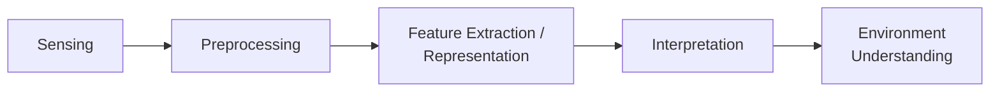

# Perception

**Purpose.** Perception turns **raw sensor data into a structured understanding of the environment**: obstacles, landmarks, free space, semantic labels, and local/global maps. It is the half of "knowing" that answers **"what is *around* me?"** — distinct from [Sensors & State Estimation](state-estimation.md), which answers **"where am *I*?"** (self-pose, velocity). Both feed the [The Autonomy Stack](../foundations/autonomy-stack.md), but perception's product is a **world model**, not a self-estimate.

## Conceptual pipeline

**Block view.** Input: raw sensor data (frames, scans, ranges). Output: a structured world model. Goal: give meaningful, usable world information to [Planning & Navigation](planning.md). The key abstraction is that **planning consumes this structured output — not raw pixels**. A planner never reasons over a camera image directly; it reasons over an occupancy grid, a cost map, or a list of obstacles that perception has produced. This separation is what lets the rest of the stack stay sensor-agnostic.

## Pipeline stages in detail

| Stage | What happens | Why it matters |
|-------|--------------|----------------|
| **Sensing** | acquire raw frames/scans (camera, LiDAR, radar, RGB-D, ultrasonic) | the entry point; every downstream error inherits this stage's noise, blur, occlusion |
| **Preprocessing** | denoise, calibrate, undistort, **time-sync** measurements | misaligned timestamps or an uncalibrated lens silently corrupt every later stage |
| **Feature extraction / representation** | edges, corners, **keypoints + descriptors**, occupancy cells | compresses raw data into compact, matchable structures usable for mapping & localization |
| **Interpretation** | label obstacle vs free vs landmark; **detection / segmentation** produce "semantic" info | this is where pixels become *meaning* (this cell is occupied, that blob is a person) |
| **Environment understanding** | a fused world model handed to planning | the deliverable: the structured map the planner actually searches |

The pipeline is a **funnel**: high-bandwidth raw data in, low-bandwidth structured meaning out. Each stage both compresses and risks discarding information that a later stage needed.

## Sensor modalities

No single modality is sufficient; each trades richness against robustness, range, and resolution.

| Modality | Gives | Weakness / failure mode |
|----------|-------|-------------------------|
| **Camera** | rich scene, color, texture, landmarks | blur, lighting dependence, occlusion; heavy processing; no direct range |
| **LiDAR / ToF** | accurate range & 3D structure | noisy returns, cost, reflective/transparent surfaces, rain/dust |
| **Radar** | weather-robust range + **Doppler velocity** | low spatial resolution |
| **Depth / RGB-D** | per-pixel depth aligned to color | short range, struggles outdoors / in sunlight |
| **Ultrasonic** | cheap short-range proximity | very short range, wide cone, poor angular resolution |

The practical answer is **complementary fusion**: pair a rich-but-fragile modality (camera) with a robust-but-coarse one (radar/LiDAR) so the combination degrades gracefully where either alone would fail.

## Representations and maps

How the world model is stored shapes what planning can do with it.

| Representation | Stores | Best for |
|----------------|--------|----------|
| **Occupancy grid** | free/occupied **probability** per cell | 2D navigation, cost maps, probabilistic updates |
| **Point cloud** | raw 3D points | LiDAR/depth output, surface reconstruction |
| **Voxel / TSDF volume** | 3D occupancy / signed distance to surfaces | dense 3D mapping, fusion of many depth frames |
| **Semantic map** | per-region/object class labels | task-level reasoning (avoid people, land on pad) |
| **Topological map** | nodes (places) + edges (connectivity) | long-range routing, compact graphs |

**Local vs global.** A **local map** captures the immediate surroundings for fast reactive avoidance (short horizon, frequently rebuilt); a **global map** supports long-range routing toward the goal. They mirror the local/global split in [Planning & Navigation](planning.md) — local perception feeds local planning, global maps feed global planning.

## Perception as probabilistic belief

Because sensors are imperfect, perception is best framed as maintaining a **belief over world/robot state** — the same Bayes → Markov → Kalman machinery used in [Sensors & State Estimation](state-estimation.md). A discretized **grid/histogram** filter is the natural belief representation for an occupancy map (a probability per cell), while a Gaussian (Kalman) belief is the compact alternative for continuous state. The world model is therefore not a set of hard facts but a **distribution that is continually predicted and corrected** as new measurements arrive; a measured cell becomes *more probably* occupied, never certainly so.

**Challenges that force this probabilistic view:**

- **Lighting / blur** — appearance changes that defeat naive matching.
- **Occlusion** — you never see the whole world at once; large regions are simply unknown.
- **Sensor noise** — every reading is a hidden truth plus noise.
- **IMU drift / GPS dropout** — the pose that anchors the map is itself uncertain.
- **Perceptual aliasing** — **different places that look the same**. This is the deepest trap: a feature-matcher can confidently localize the robot in the wrong place because two corridors, two corners, or two facades are visually identical. Probabilistic representations (multi-hypothesis beliefs, particle filters) exist precisely so that aliasing produces *ambiguity* rather than a confident wrong answer.

## Failure mode

**Miss an obstacle → the planner routes through it → collision even with perfect localization.** Perception failures are insidious because they are silent: the rest of the stack trusts the world model. A correct planner on a correct pose still drives into a wall if perception never reported the wall. This is why perception output must carry **confidence**, not just geometry, when it crosses the interface into planning (see [System Integration & Robustness](integration-robustness.md)).

## Related

- [Sensors & State Estimation](state-estimation.md) — "where am I" vs perception's "what is around me"; shared Bayes/Kalman belief machinery.
- [Planning & Navigation](planning.md) — the consumer of perception's structured maps and cost maps.
- [System Integration & Robustness](integration-robustness.md) — passing perception confidence/health across interfaces, frame consistency.
- [The Autonomy Stack](../foundations/autonomy-stack.md) — where perception sits in the knowing/acting loop.
- [State-Space Modeling](state-space.md) — the continuous belief over state that perception helps update.
