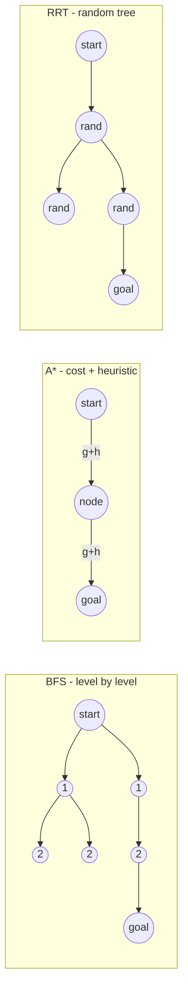

# Planning & Navigation

**Purpose.** Choose a **safe route** from the current state to the goal. **Navigation** is the overall process of getting there safely; planning is the part that *picks where to go*. Planning consumes the structured world model from [Perception](perception.md) and the pose from [Sensors & State Estimation](state-estimation.md), and hands a route down to [Trajectory Generation & Tracking](trajectory.md), which makes it *flyable*.

## Global vs local planning

- **Global planning** — the long-range route toward the goal, computed on the **map**. It answers "what is the overall path?" given everything known in advance.
- **Local planning** — short-range reaction to nearby obstacles and disturbances — the things you **didn't know globally**. It answers "what do I do right now given what just appeared?"

A robust navigator runs both: a global plan for direction, a local planner for survival. This mirrors the **local vs global map** split in [Perception](perception.md).

## Configuration space (C-space)

Planning searches **C-space, not raw workspace**. The configuration space is the space of all robot configurations:

- a **point robot** → `(x, y)`;
- a **rigid body** → `(x, y, θ)`;
- an **arm** → the vector of joint angles (see [Forward & Inverse Kinematics](../kinematics/forward-inverse-kinematics.md)).

In C-space, obstacles become **forbidden configurations** `C_obs`, and a feasible path lives entirely in **free space** `C_free`. A standard trick is the **robot-as-point abstraction**: *inflate* every obstacle by the robot radius, then plan a single point through the inflated free space — this folds the robot's size into the map so the planner can treat it as dimensionless. This whole formulation is the classic **Piano Mover's Problem**: find a collision-free path A→B given the geometry — **PSPACE-hard** in general, which is why practical planners approximate rather than solve it exactly.

## Feasibility vs optimization

- **Feasibility** — find *any* collision-free path. Already hard (Piano Mover's).
- **Optimization** — among feasible paths, **minimize** distance / time / energy / risk, or **maximize** clearance.

Most planners separate these: get a feasible path first, then improve it. Note this is geometric feasibility only — a geometrically valid path can still be **dynamically infeasible** to fly; that constraint is enforced later by [Trajectory Generation & Tracking](trajectory.md).

## Discrete search

Discretize the space into a **grid** (4- or 8-connected), drop obstacle cells, then search the resulting graph. BFS, DFS, Dijkstra, and A* are the **same forward-search loop** — they differ only in *which node is expanded next*; the path is recovered by backtracking **parent pointers**.

| Algorithm | Expands next | Complete? | Optimal? | Notes |
|-----------|-------------|-----------|----------|-------|
| **BFS** | FIFO (level by level) | yes | only if all edges equal cost | shortest in *#steps*; not goal-directed, memory-heavy |
| **DFS** | LIFO (go deep) | yes (finite) | no | low memory, can wander |
| **Dijkstra** | min cost-so-far `g` | yes | **yes** | uniform outward growth (wasteful); = A* with `h=0` |
| **Greedy best-first** | min heuristic `h` | no | no | fast, dives at goal, can be misled |
| **A\*** | min `f = g + h` | yes | **yes** if `h` admissible | goal-directed; expands far fewer nodes than Dijkstra |

The central formula: `f(n) = g(n) + h(n)`, where `g` = actual cost-so-far and `h` = estimated cost-to-go. A heuristic is **admissible** when it **never overestimates** the true remaining cost (e.g. straight-line Euclidean distance) → this guarantees A* returns an optimal path. A heuristic is **consistent** when `h(n) ≤ cost(n, n') + h(n')` for every edge — a stronger property that additionally guarantees **no node is ever re-expanded**, keeping A* efficient. A* is Dijkstra made goal-directed: the `h` term pulls expansion toward the goal instead of growing a wasteful uniform circle.

## Sampling-based planning

For **continuous / high-dimensional** spaces — like a multi-joint arm, or a drone in cluttered 3D — building the full grid is infeasible (the cell count explodes with dimension). Sampling-based planners sidestep this: they need only a **fast per-configuration collision check**, never an explicit `C_obs`.

| Algorithm | Idea | When it shines |
|-----------|------|----------------|
| **RRT** | grows a **tree by random sampling**, extending a small step toward each sample | high-dim / continuous; feasibility-first |
| **RRT\*** | RRT + **rewiring** → **asymptotically optimal** | when path quality (length / smoothness) matters |
| **PRM** | sample a reusable **roadmap** graph, then graph-search it | many queries on one **static** map |

**The RRT loop (in words):** sample a random configuration `q_rand` → find the **nearest** existing tree node `q_near` → **extend** a small step from `q_near` toward `q_rand` → keep the new node **only if** the connecting motion is collision-free → repeat, stopping when the tree reaches close to the goal. RRT is **not complete**, but it is **probabilistically complete**: the probability of finding a path → 1 as the number of samples → ∞. Its paths are **jagged** and usually need a **smoothing** post-process before they can be handed to trajectory generation.

## Potential fields

A **reactive local method**: the goal exerts an **attractive** potential, obstacles exert **repulsive** potentials, and the robot simply follows the **negative gradient** of the summed field. It is extremely cheap and naturally reactive — but its fatal weakness is **local minima**, points where attractive and repulsive forces cancel and the robot stalls short of the goal (a U-shaped obstacle is the classic trap). This makes pure potential fields unreliable as a sole global planner.

## Maps and cost maps

Planning runs on **occupancy / grid maps** (free/occupied cells) and, more richly, on **cost maps** that assign a per-cell or per-edge **traversal cost** — distance, time, risk, or proximity to obstacles. These costs **are exactly the edge weights** that Dijkstra and A* minimize. **Inflating cost near obstacles** (rather than marking them as hard-forbidden) biases the optimal path to keep **clearance**, producing routes that hug the middle of free corridors instead of scraping walls.

## Failure mode

**A plan built on bad perception or localization can be valid on paper but unsafe in reality.** The planner is only as trustworthy as its inputs: a route through an occupancy grid that missed an obstacle, or computed from a drifted pose, is geometrically perfect and physically lethal. Planning correctness must therefore be judged on the *real* world, not the assumed map — a theme of [System Integration & Robustness](integration-robustness.md). Equally, an over-optimistic plan that ignores dynamics produces an infeasible reference that the controller cannot track.

## Related

- [Perception](perception.md) — supplies the maps, cost maps, and obstacles the planner searches.
- [Sensors & State Estimation](state-estimation.md) — supplies the pose the plan starts from; bad localization breaks good plans.
- [Trajectory Generation & Tracking](trajectory.md) — turns the geometric path into a dynamically feasible, timed reference.
- [Mission Logic & FSM](mission-fsm.md) — decides *whether* to plan/replan at all; planning alone isn't autonomy.
- [Forward & Inverse Kinematics](../kinematics/forward-inverse-kinematics.md) — the joint-angle C-space for manipulators.
- [System Integration & Robustness](integration-robustness.md) — why a paper-valid plan can be unsafe in practice.
