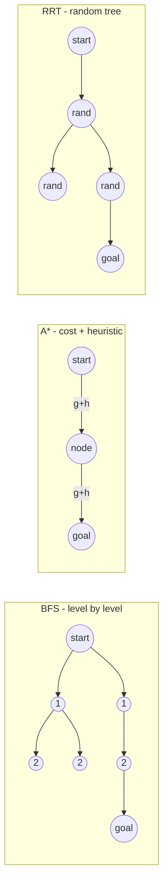

# Planning & Navigation

**Planning** picks *where to go*; **navigation** is the whole safe-arrival process. Consumes the world model from [Perception](perception.md) and pose from [Sensors & State Estimation](state-estimation.md); emits a route to [Trajectory Generation & Tracking](trajectory.md) to make it flyable.

## Global vs local

- **Global** — long-range route on the **map**; "what's the overall path?"
- **Local** — short-range reaction to what you didn't know globally; "what do I do *now*?"

Run both: global for direction, local for survival. Mirrors the local/global map split in [Perception](perception.md).

## Configuration space (C-space)

Search **C-space, not workspace**. Configs: point robot → `(x,y)`; rigid body → `(x,y,θ)`; arm → joint-angle vector ([Forward & Inverse Kinematics](../kinematics/forward-inverse-kinematics.md)).

- Obstacles → forbidden configs `C_obs`; feasible path lives in `C_free`.
- **Robot-as-point**: inflate obstacles by robot radius, plan a dimensionless point.
- **Piano Mover's Problem** — collision-free A→B given geometry; **PSPACE-hard** → practical planners approximate.

## Feasibility vs optimization

- **Feasibility** — *any* collision-free path (already hard).
- **Optimization** — minimize distance/time/energy/risk, or maximize clearance.

Usual split: feasible first, then improve. Geometric feasibility only — a valid path can be **dynamically infeasible**; enforced later by [Trajectory Generation & Tracking](trajectory.md).

## Discrete search

Grid (4/8-connected), drop obstacle cells, search the graph. BFS/DFS/Dijkstra/A* are the **same forward-search loop**, differing only in *which node expands next*; recover path via **parent pointers**.

| Algorithm | Expands next | Complete? | Optimal? | Notes |
|-----------|-------------|-----------|----------|-------|
| **BFS** | FIFO (by level) | yes | only if equal edge cost | shortest in steps; memory-heavy |
| **DFS** | LIFO (deep) | yes (finite) | no | low memory, wanders |
| **Dijkstra** | min `g` | yes | **yes** | uniform growth; = A* with `h=0` |
| **Greedy best-first** | min `h` | no | no | fast, dives at goal, misleadable |
| **A\*** | min `f=g+h` | yes | **yes** if `h` admissible | goal-directed; far fewer expansions |

`f(n) = g(n) + h(n)`, `g`=cost-so-far, `h`=cost-to-go estimate.

- **Admissible** `h` — never overestimates (e.g. Euclidean) → optimal A*.
- **Consistent** `h` — `h(n) ≤ cost(n,n') + h(n')` → no node re-expanded.
- A* = goal-directed Dijkstra; `h` pulls expansion toward goal vs wasteful circle.

## Sampling-based planning

For continuous / high-dim spaces (multi-joint arm, cluttered 3D) full grids explode. Need only a **fast per-config collision check**, never explicit `C_obs`.

| Algorithm | Idea | Shines when |
|-----------|------|-------------|
| **RRT** | random-sampled tree, small step toward each sample | high-dim; feasibility-first |
| **RRT\*** | RRT + rewiring → **asymptotically optimal** | path quality matters |
| **PRM** | reusable roadmap, then graph-search | many queries, **static** map |

**RRT loop:** sample `q_rand` → nearest node `q_near` → extend small step toward `q_rand` → keep only if motion collision-free → repeat until near goal.

- Not complete but **probabilistically complete** (P→1 as samples→∞).
- Paths are **jagged** → need **smoothing** before trajectory generation.

## Potential fields

Reactive local method: goal **attracts**, obstacles **repel**, follow negative gradient of summed field. Cheap and reactive.

- **Gotcha:** **local minima** — forces cancel, robot stalls (U-shaped obstacle trap) → unreliable as sole global planner.

## Maps and cost maps

Runs on occupancy/grid maps and richer **cost maps** (per-cell/edge traversal cost = distance/time/risk/clearance). These costs **are** the edge weights Dijkstra/A* minimize. **Inflating cost near obstacles** (vs hard-forbidding) biases paths toward clearance — hug corridor centers, not walls.

## Failure mode

**A plan on bad perception/localization is valid on paper, unsafe in reality.** A route through a grid that missed an obstacle, or from a drifted pose, is geometrically perfect and physically lethal — judge correctness on the *real* world ([System Integration & Robustness](integration-robustness.md)). An over-optimistic plan that ignores dynamics yields an infeasible reference the controller can't track.

## Related

- [Perception](perception.md) — supplies the maps, cost maps, and obstacles the planner searches.
- [Sensors & State Estimation](state-estimation.md) — supplies the pose the plan starts from; bad localization breaks good plans.
- [Trajectory Generation & Tracking](trajectory.md) — turns the geometric path into a dynamically feasible, timed reference.
- [Mission Logic & FSM](mission-fsm.md) — decides *whether* to plan/replan at all; planning alone isn't autonomy.
- [Forward & Inverse Kinematics](../kinematics/forward-inverse-kinematics.md) — the joint-angle C-space for manipulators.
- [System Integration & Robustness](integration-robustness.md) — why a paper-valid plan can be unsafe in practice.

## Handbook references
- *Underactuated Robotics* — [Sampling-based Motion Planning](https://underactuated.csail.mit.edu/planning.html) · [Dynamic Programming](https://underactuated.csail.mit.edu/dp.html) · [Feedback Motion Planning](https://underactuated.csail.mit.edu/feedback_motion_planning.html)
- *Robotic Manipulation* — [Motion Planning](https://manipulation.csail.mit.edu/trajectories.html)
