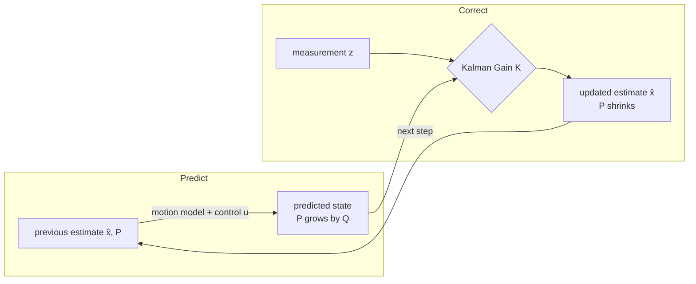

# Sensors & State Estimation

## Sensors measure, not truth

A sensor reports a corrupted view: **noise** (random), **bias** (systematic), **delay** (latency), **uncertainty**.

    z = h(x) + v

| Sensor | Gives | Weakness |
|--------|-------|----------|
| **GPS** | absolute position | coarse (2–10 m), drops indoors, low rate, spoofable |
| **IMU** | accel, angular rate (fast) | **drifts** when integrated |
| **Camera** | rich scene, landmarks | heavy processing, lighting-dependent |
| **LiDAR / Ultrasonic** | distance to obstacles | range / FOV limits |
| **Altimeter / Barometer** | altitude | noisy, weather-sensitive |

- **Error sources:** white noise, bias (incl. temp drift), scale-factor, axis misalignment, EM/vibration, outliers.
- **Proprioceptive** (own state: IMU, encoders, baro) vs **exteroceptive** (world: camera, LiDAR, GPS, mag).
- **Active** (emit: LiDAR/ToF, radar, ultrasonic) vs **passive** (receive: camera, gyro, accel, GPS).

## Why integration drifts (INS)

- Accel → vel → position: **position error ∝ t²**; gyro bias → **attitude error ∝ t** ("gyro bias is the worst enemy of an INS").
- **INS** — self-contained, kHz, jam-immune, but accumulates error → good only short-term, must be **aided** by an absolute sensor.
- **GPS + INS split:** INS gives high-rate relative motion, GPS gives low-rate absolute fixes that **reset drift**.
- Acting on raw noisy readings makes [Control Systems & PID](control-pid.md) jittery and [Planning & Navigation](planning.md) unreliable.

## State estimation — predict then correct

Produce best guess `x̂` **+ a confidence** by combining prediction (motion model) with correction (measurements).

### Bayes filter (general framework)

Maintain a **belief** `bel(xₜ) = p(xₜ | z₁:ₜ, u₁:ₜ)` — a whole distribution. Update via **posterior ∝ likelihood × prior**:

    bel(xₜ) = η · p(zₜ|xₜ) · ∫ p(xₜ|uₜ, xₜ₋₁)·bel(xₜ₋₁) dxₜ₋₁

- **Predict** pushes belief through motion model (uncertainty **grows**); **update** multiplies by sensor likelihood, renormalize (uncertainty **shrinks**). Every filter below is a special case.
- **Markov assumption:** next state depends only on current state/action/observation → makes recursive filtering tractable.
- Models: process `xₜ = f(xₜ₋₁, uₜ, wₜ)`, measurement `zₜ = h(xₜ, vₜ)`.
- **Flavors:** filtering = now; prediction = future; smoothing = past using later data.

### Kalman filter (optimal linear-Gaussian)

Optimal Bayes filter for linear + Gaussian. Belief = **mean + covariance** only.

**1-D intuition:** predict `x_pred = x_est + v·dt`, `P_pred = P + Q` (grows); gain `K = P_pred/(P_pred+R)` ∈ [0,1]; correct `x_est = x_pred + K·(z − x_pred)`; shrink `P = (1−K)·P_pred`.

**Matrix form** — `xₜ = A·xₜ₋₁ + B·uₜ + w` (`w∼𝒩(0,Q)`), `zₜ = H·xₜ + v` (`v∼𝒩(0,R)`):

    Predict:  μ̄ = A·μ + B·u          P̄ = A·P·Aᵀ + Q
    Update:   K = P̄·Hᵀ(H·P̄·Hᵀ + R)⁻¹
              μ = μ̄ + K·(z − H·μ̄)        (innovation = z − H·μ̄)
              P = (I − K·H)·P̄

| Symbol | Meaning |
|--------|---------|
| `A` (F) | state-transition (motion) matrix |
| `B`, `u` | control matrix, control input |
| `Q` | process-noise covariance (model trust) |
| `H` (C) | measurement matrix (state → measurement space) |
| `R` | measurement-noise covariance (sensor accuracy) |
| `P` (Σ) | state covariance (uncertainty) |
| `K` | Kalman gain (trust dial) |

- Variance update is **independent of the measurement value**; a measurement never increases variance; with non-Gaussian noise still best *linear* estimator. **Cons:** linear+Gaussian only, single (unimodal) hypothesis.

### Kalman gain = trust dial = fusion

- Large **R** → small `K` → **trust model**.
- Large **Q** → large `K` → **trust measurement**.

That weighting *is* sensor fusion (GPS + IMU → better than either alone). If GPS drops, lean on IMU + camera + model — but uncertainty grows, so not forever.

### EKF

Nonlinear dynamics break the Gaussian assumption. EKF **linearizes** via first-order Taylor about current estimate: replace `A`, `H` with Jacobians `Fₖ = ∂f/∂x`, `Hₖ = ∂h/∂x` each step; rest identical. Runs nearly every autopilot (PX4, ArduPilot). **Limits:** linearization error if highly nonlinear / poorly initialized; still unimodal; Jacobians hard to derive; can diverge.

### Filter zoo (all Bayes filters)

| Filter | Belief | Good for | Cost |
|--------|--------|----------|------|
| **Kalman (KF)** | Gaussian (mean+cov) | linear + Gaussian | very cheap |
| **EKF** | Gaussian, Jacobian-linearized | mildly nonlinear (drones) | cheap |
| **UKF** | Gaussian via **sigma points** | stronger nonlinearity, no Jacobians | ~EKF |
| **Information filter** | Gaussian as info matrix `P⁻¹` | multi-sensor fusion, sparse | cheap update |
| **Histogram / grid** | probs over discretized grid | small, **multi-modal**, discrete | exp in dim |
| **Particle (PF)** | **N weighted samples** | **highly nonlinear / multi-modal**, kidnapped | expensive |

- **Particle filter (SIR):** (1) sample from prior; (2) propagate through motion model; (3) weight `w ∝ p(z|x)`; (4) resample (duplicate high, drop low → avoids depletion). → KF as `N → ∞` in Gaussian case.
- **Complementary filter** (lightweight, non-probabilistic): high-pass gyro + low-pass accel/mag for attitude; common on small drones where a KF is overkill.

## Localization vs SLAM

- **Localization** = pose on a **known** map. Regimes: **tracking** (start known); **global** (start unknown); **kidnapped robot** (suddenly displaced → must re-localize; hardest, needs multi-modal filters).
- **SLAM** = no prior map → solve localization + mapping jointly (EKF-SLAM, Graph-SLAM, visual-inertial / LiDAR SLAM).

## Perception vs state estimation

State estimation = **"where am I?"** (self). [Perception](perception.md) = **"what is around me?"** (world). Same sensors, different question.

## Failure mode

A bad estimate **silently** corrupts both [Control Systems & PID](control-pid.md) and [Planning & Navigation](planning.md); danger is when the *confidence* is wrong (overconfident divergence). [System Integration & Robustness](integration-robustness.md) watches covariance growth as a fault signal.

## Related

- [Control Systems & PID](control-pid.md) — consumes the estimate `x̂` as feedback.
- [Perception](perception.md) — the complementary "what is around me" pipeline.
- [Planning & Navigation](planning.md) — plans from the estimated pose and map.
- [State-Space Modeling](state-space.md) — the process/measurement models and observability the filter relies on.
- [Coordinate Frames & Transforms](../geometry/coordinate-frames.md) — estimates are only meaningful with a frame + timestamp.
- [System Integration & Robustness](integration-robustness.md) — confidence/health, redundancy, and fault detection from covariance.
- [The Autonomy Stack](../foundations/autonomy-stack.md) — where estimation sits among the knowing blocks.

## Handbook references
- *Underactuated Robotics* — [State Estimation](https://underactuated.csail.mit.edu/state_estimation.html) · [Output Feedback](https://underactuated.csail.mit.edu/output_feedback.html) · [System Identification](https://underactuated.csail.mit.edu/sysid.html)
- *Robotic Manipulation* — [Geometric Pose Estimation](https://manipulation.csail.mit.edu/pose.html)
