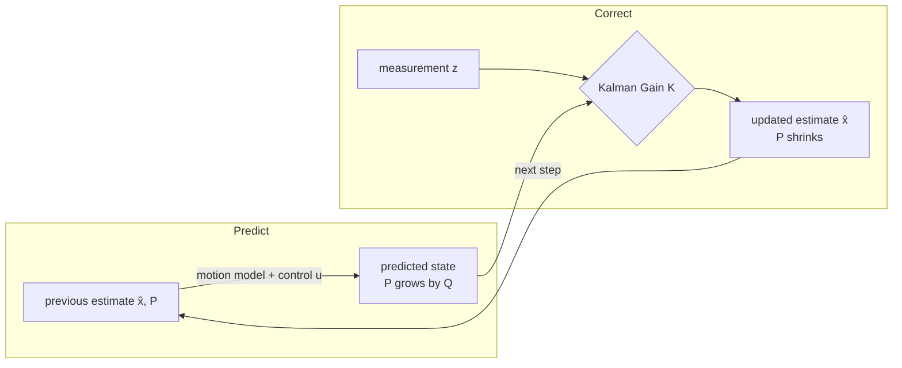

# Sensors & State Estimation

## Sensors are measurements, not truth

A sensor never reports the true state — it reports a **corrupted view** of it. Every reading carries **noise** (random), **bias** (systematic offset), **delay** (latency), and **uncertainty**. The general sensor model is:

    z = h(x) + v

a reading `z` equals some function `h` of the hidden true state `x`, plus measurement noise `v`. No single sensor is enough:

| Sensor | Gives | Weakness |
|--------|-------|----------|
| **GPS** | absolute position | coarse (2–10 m), droppable indoors / urban canyons, low rate, spoofable |
| **IMU** | acceleration, angular rate (fast) | **drifts** when integrated |
| **Camera** | rich scene info, landmarks | needs heavy processing, lighting-dependent |
| **LiDAR / Ultrasonic** | distance to obstacles | range / FOV limits |
| **Altimeter / Barometer** | altitude | noisy, weather-sensitive |

**Error sources:** random (white) noise, systematic **bias** (incl. temperature drift), scale-factor error, axis **misalignment**, environmental disturbance (EM, vibration), and outliers/glitches.

**Two useful classifications.**
- *Proprioceptive* (measure the robot's **own state**: IMU, encoders, barometer) vs *exteroceptive* (measure **the world**: camera, LiDAR, GPS, magnetometer).
- *Active* (emit energy: LiDAR/ToF, radar, ultrasonic) vs *passive* (only receive: camera, gyro, accelerometer, GPS).

## Why integration drifts (dead reckoning / INS)

An IMU is **integrated** to recover motion, and integration compounds error. Accelerometer → velocity → position means **position error grows ∝ t²**; gyro bias makes **attitude error grow ∝ t** — "gyro bias is the worst enemy of an INS." An **INS (inertial navigation system)** is self-contained, very high-rate (kHz), and immune to jamming, but it accumulates error, so it is only good **short-term** and must be **aided** by an absolute sensor.

This is the classic **GPS + INS** split: the INS gives high-rate *relative* motion, GPS gives low-rate *absolute* fixes that **reset the drift**. Acting **directly** on a noisy/biased/delayed reading makes [Control Systems & PID](control-pid.md) jittery and [Planning & Navigation](planning.md) unreliable — which is exactly why we need state estimation between sensing and acting.

## State estimation — predict then correct

**Purpose.** Produce the best guess of the state `x̂` **plus a confidence**, by combining a **prediction** (motion model) with a **correction** (measurements).

### Bayes filter (the general framework)

Maintain a **belief** `bel(xₜ) = p(xₜ | z₁:ₜ, u₁:ₜ)` — a whole **distribution** over states, not a single point. Update it with **posterior ∝ likelihood × prior**:

    bel(xₜ) = η · p(zₜ|xₜ) · ∫ p(xₜ|uₜ, xₜ₋₁)·bel(xₜ₋₁) dxₜ₋₁

where `η = 1/p(z)` is the normalizer. Two steps repeat forever: **predict** (push the belief through the motion model — uncertainty **grows**) then **update/correct** (multiply by the sensor likelihood and renormalize — uncertainty **shrinks**). Every practical filter below is a special case of this under different assumptions.

- **Markov assumption:** the next state depends **only** on the *current* state, action, and observation — `p(xₜ₊₁|x₀:ₜ) = p(xₜ₊₁|xₜ)` — not the whole history. This is what makes recursive (real-time) filtering tractable.
- **Two models feed it:** a *process/motion* model `xₜ = f(xₜ₋₁, uₜ, wₜ)` (process noise `w`) and a *measurement* model `zₜ = h(xₜ, vₜ)` (measurement noise `v`).
- **Estimation flavors:** *filtering* = estimate **now**; *prediction* = estimate a **future** state; *smoothing* = re-estimate a **past** state using later data.

### Kalman filter (optimal linear-Gaussian)

The Kalman filter is the **optimal** Bayes filter for **linear systems with Gaussian noise**. Because a linear map of a Gaussian stays Gaussian, the entire belief is summarized by just a **mean + covariance**.

**The 1-D idea in four moves (in words).** First **predict**: move the estimate forward with the motion model (e.g. `x_pred = x_est + velocity·dt`), and let its uncertainty **grow** by the process noise, `P_pred = P + Q`. Then compute the **gain** `K = P_pred / (P_pred + R)` — a number between 0 and 1 saying how much to trust the new measurement. **Correct** by nudging the prediction toward the measurement in proportion to the gain, `x_est = x_pred + K·(z − x_pred)`. Finally the uncertainty **shrinks**, `P = (1 − K)·P_pred`, because a measurement has been folded in.

**Full (matrix) Kalman filter.** With linear models `xₜ = A·xₜ₋₁ + B·uₜ + w` (`w ∼ 𝒩(0, Q)`) and `zₜ = H·xₜ + v` (`v ∼ 𝒩(0, R)`), the state is carried as mean `μ` and covariance `P`:

    Predict:  μ̄ = A·μ + B·u          P̄ = A·P·Aᵀ + Q        (uncertainty grows by Q)
    Update:   K = P̄·Hᵀ(H·P̄·Hᵀ + R)⁻¹                        (Kalman gain)
              μ = μ̄ + K·(z − H·μ̄)                            (innovation = z − H·μ̄)
              P = (I − K·H)·P̄                                (uncertainty shrinks)

| Symbol | Meaning |
|--------|---------|
| `A` (a.k.a. F) | state-transition (motion) matrix |
| `B`, `u` | control matrix, control input |
| `Q` | **process**-noise covariance (model trust) |
| `H` (a.k.a. C) | measurement matrix (state → measurement space) |
| `R` | **measurement**-noise covariance (sensor accuracy) |
| `P` (Σ) | state covariance (uncertainty) |
| `K` | Kalman gain (the trust dial) |

**Properties:** the variance update is **independent of the actual measurement value**; a measurement never *increases* variance; with non-Gaussian noise it is still the best *linear* (minimum-variance) estimator. **Cons:** linear + Gaussian only, and it can represent only a **single (unimodal)** hypothesis.

### The Kalman gain is the trust dial = sensor fusion

- Large **measurement noise `R`** → small `K` → **trust the model**.
- Large **process noise `Q`** → large `K` → **trust the measurement**.

That weighting *is* **sensor fusion**: combine GPS + IMU, weighting each by how reliable it is, to get a position estimate **more accurate and stable than either alone**. If GPS drops, you can keep flying for a while by leaning on IMU + camera + the motion model — but uncertainty grows, so not forever.

### EKF — Extended Kalman filter

Real dynamics and GPS/vision models are **nonlinear**, and a Gaussian pushed through a nonlinear function is no longer Gaussian. The EKF **linearizes** with a first-order Taylor expansion about the current estimate: replace `A` and `H` with the **Jacobians** `Fₖ = ∂f/∂x|_x̂` and `Hₖ = ∂h/∂x|_x̂` each step; the rest of the equations are identical. It runs nearly every real autopilot (PX4, ArduPilot). **Limits:** linearization error if highly nonlinear or poorly initialized; still unimodal Gaussian; Jacobians can be hard to derive; it can diverge.

### The filter zoo (all are Bayes filters)

| Filter | Belief representation | Good for | Cost |
|--------|----------------------|----------|------|
| **Kalman (KF)** | Gaussian (mean + cov) | linear + Gaussian | very cheap |
| **EKF** | Gaussian, Jacobian-linearized | mildly nonlinear (drones) | cheap |
| **UKF** (unscented) | Gaussian via **sigma points** through the true nonlinearity | stronger nonlinearity, no Jacobians | ~EKF |
| **Information filter** | Gaussian as **info matrix `P⁻¹`** (dual of KF) | multi-sensor fusion, sparse problems | cheap update |
| **Histogram / grid** | probabilities over a discretized grid | small, **multi-modal**, discrete maps | exponential in dim |
| **Particle (PF)** | **N weighted samples** | **highly nonlinear / multi-modal**, kidnapped robot | expensive |

**Particle filter in 4 steps (SIR):** (1) sample particles from the prior; (2) **propagate** each through the motion model; (3) **weight** each by the sensor likelihood `w ∝ p(z|x)`; (4) **resample** — duplicate high-weight, drop low-weight particles (avoids "particle depletion"). It handles non-Gaussian, multi-modal beliefs (e.g. re-localizing after GPS loss) and → KF as `N → ∞` in the Gaussian case.

**Complementary filter** (lightweight, non-probabilistic): high-pass the fast sensor (gyro) + low-pass the slow/absolute one (accelerometer/magnetometer) for attitude — common on small drones where a full KF is overkill.

## Localization vs SLAM

**Localization** = estimate pose on a **known** map. Three regimes:
- **tracking** — start position known, track from there;
- **global localization** — start position unknown;
- **kidnapped robot** — was localized, then suddenly displaced/lost → must **re-localize** (the hardest case, and why multi-modal filters matter).

When there is **no prior map**, the robot must do **SLAM** — Simultaneous Localization And Mapping — solving the chicken-and-egg of needing a map to localize and a pose to map, **jointly** (EKF-SLAM, Graph-SLAM, visual-inertial / LiDAR SLAM).

## Perception vs state estimation

State estimation answers **"where am *I*?"** (self: pose, velocity). [Perception](perception.md) answers **"what is *around* me?"** (world: obstacles, free space). Same sensors, different question.

## Failure mode

A bad estimate **silently** corrupts both [Control Systems & PID](control-pid.md) (tracks the wrong place) *and* [Planning & Navigation](planning.md) (plans from a wrong position) — and because it carries a confidence, the danger is when that confidence is *wrong* (overconfident divergence). This is why [System Integration & Robustness](integration-robustness.md) watches covariance growth as a fault signal.

## Related

- [Control Systems & PID](control-pid.md) — consumes the estimate `x̂` as feedback.
- [Perception](perception.md) — the complementary "what is around me" pipeline.
- [Planning & Navigation](planning.md) — plans from the estimated pose and map.
- [State-Space Modeling](state-space.md) — the process/measurement models and observability the filter relies on.
- [Coordinate Frames & Transforms](../geometry/coordinate-frames.md) — estimates are only meaningful with a frame + timestamp.
- [System Integration & Robustness](integration-robustness.md) — confidence/health, redundancy, and fault detection from covariance.
- [The Autonomy Stack](../foundations/autonomy-stack.md) — where estimation sits among the knowing blocks.
