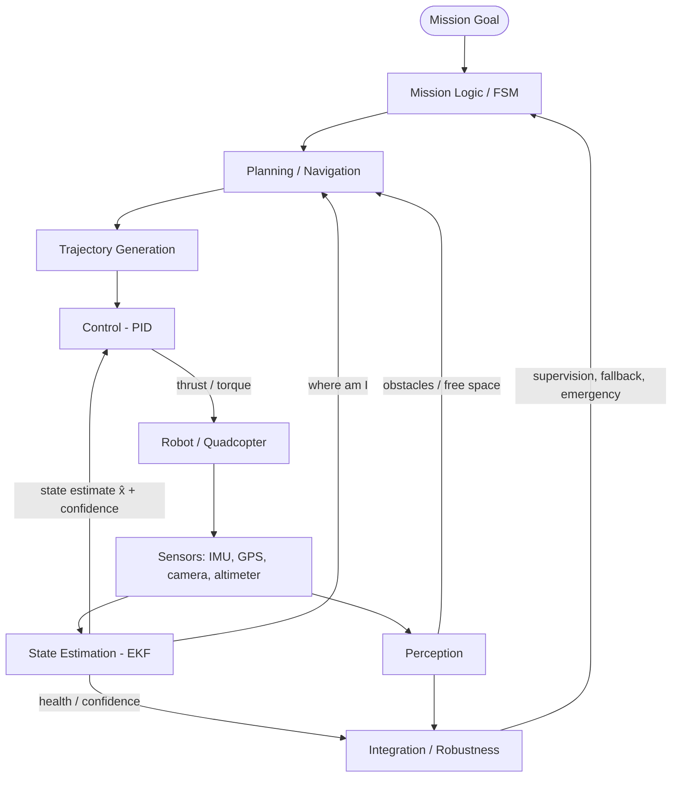
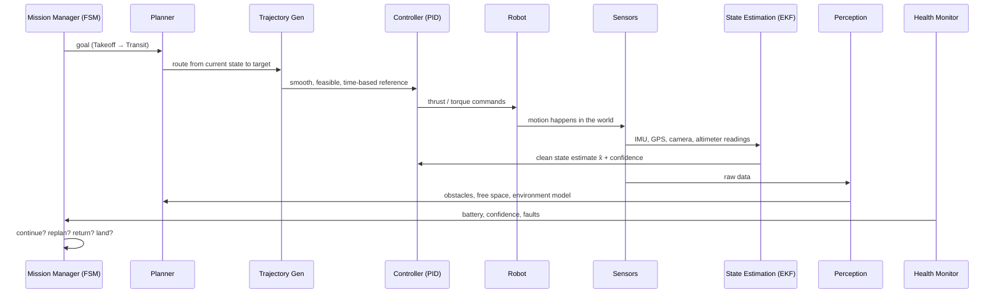

# The Autonomy Stack

This is the **hub note**. It assembles every other topic in the vault into one picture: the **master
autonomy block diagram**. Where [Introduction to Robotics & Autonomy](introduction.md) introduces the
**Sense–Think–Act** loop and [Automation vs Autonomy](automation-vs-autonomy.md) explains *why* an open world demands real
decision-making, this note shows **how the blocks connect into a single closed loop** — and how a fault
in one block propagates through the rest.

## The master autonomy block diagram

Every arrow is a **dependency and an interface**. Information flows *down* the left side as commands
(decide → plan → shape → control → act) and flows *up* the right side as knowledge (measure → estimate →
interpret → inform). Robustness watches the whole thing.

## Acting blocks vs. Knowing blocks

The stack splits cleanly into two halves of the Sense–Think–Act loop:

| | **Acting** (the "Act/decide" half) | **Knowing** (the "Sense/understand" half) |
|---|-----------------------------------|-------------------------------------------|
| Blocks | Mission Logic/FSM, Planning, Trajectory, Control | Sensors, State Estimation, Perception |
| Question | **"What should I do, and how do I make it happen?"** | **"What is true about me and the world?"** |
| Notes | [Mission Logic & FSM](../autonomy/mission-fsm.md), [Planning & Navigation](../autonomy/planning.md), [Trajectory Generation & Tracking](../autonomy/trajectory.md), [Control Systems & PID](../autonomy/control-pid.md) | [Sensors & State Estimation](../autonomy/state-estimation.md), [Perception](../autonomy/perception.md) |

A useful split inside the Knowing half: **state estimation** answers *"where am **I**?"* (self: pose,
velocity), while **perception** answers *"what is **around** me?"* (world: obstacles, free space). Both
rest on the [State-Space Modeling](../autonomy/state-space.md) description of how the robot evolves.

## Integration / Robustness — the supervisor

[System Integration & Robustness](../autonomy/integration-robustness.md) is not in the command chain; it **sits above every block**. It
ingests **health and confidence** from estimation and perception, watches for **delay, stale data, frame
mismatch, saturation, and faults**, and feeds **supervision, fallback, and emergency** signals back into
the FSM. Its job is to ensure that locally-correct modules combine into a **globally safe** system — the
core message of [Automation vs Autonomy](automation-vs-autonomy.md) about *how systems break*.

## The closed loop in words

The robot **acts** (Control → Robot), the world responds, **sensors** measure it, **state estimation**
cleans those measurements into a believable state, **perception** interprets the surroundings, and that
information flows back up to **planning** and **mission logic**, which decide what to do next.
**Robustness supervises every block.** Nothing in the loop ever runs open — each tick of the system is
one trip around this cycle.

## The quadcopter mission story

The same stack, told as a time-ordered sequence for a takeoff-and-transit mission:

Read top to bottom: the **FSM** sets a goal, the **planner** picks a route, the **trajectory generator**
makes it dynamically flyable, the **controller** turns it into thrust/torque, the **robot** moves, the
**sensors** measure the motion, **estimation** fuses them into `x̂`, **perception** builds a world model,
the **health monitor** reports battery and faults, and the FSM **decides what to do next** — closing the
loop.

## Cross-topic dependencies (why this is one system, not seven)

Because the blocks are chained, a weakness in one **silently corrupts** those downstream:

| Weak block | Damages | Why |
|------------|---------|-----|
| **Estimation** | **Control** *and* **Planning** | both consume `x̂`; a wrong state means tracking and planning from the wrong place |
| **Perception** | **Navigation** | a missed obstacle gets routed straight through |
| **Planning** | **Trajectory** | a bad route creates **dynamically impossible** trajectories |
| **Mission logic** | **the whole mission** | poor decisions continue a **doomed** mission |
| **Integration** | **everything** | weak supervision makes even good modules **unsafe** |

This is the central lesson of the stack: **"a correct algorithm" is not enough.** A module provably
correct *in isolation* can still cause a crash if it runs on stale data, in the wrong frame, or without a
fallback. **Correctness must be defined at the integrated-system level, under uncertainty and
degradation** — which is precisely the remit of [System Integration & Robustness](../autonomy/integration-robustness.md).

## Where each block is detailed

- **Decide:** [Mission Logic & FSM](../autonomy/mission-fsm.md) — discrete mission states, transitions, fail-safe switching.
- **Route:** [Planning & Navigation](../autonomy/planning.md) — global/local planning, search, sampling, cost maps.
- **Shape:** [Trajectory Generation & Tracking](../autonomy/trajectory.md) — turning a route into a feasible, timed reference.
- **Act:** [Control Systems & PID](../autonomy/control-pid.md) — closed-loop tracking of that reference with real actuators.
- **Estimate:** [Sensors & State Estimation](../autonomy/state-estimation.md) — sensor models, fusion, Bayes/Kalman filtering.
- **Understand:** [Perception](../autonomy/perception.md) — raw data → structured world model.
- **Model:** [State-Space Modeling](../autonomy/state-space.md) — the continuous description estimation and control act on.
- **Supervise:** [System Integration & Robustness](../autonomy/integration-robustness.md) — interfaces, timing, frames, fault handling.

## Related

- [Introduction to Robotics & Autonomy](introduction.md)
- [Automation vs Autonomy](automation-vs-autonomy.md)
- [Control Systems & PID](../autonomy/control-pid.md)
- [Sensors & State Estimation](../autonomy/state-estimation.md)
- [Trajectory Generation & Tracking](../autonomy/trajectory.md)
- [Perception](../autonomy/perception.md)
- [Planning & Navigation](../autonomy/planning.md)
- [Mission Logic & FSM](../autonomy/mission-fsm.md)
- [State-Space Modeling](../autonomy/state-space.md)
- [System Integration & Robustness](../autonomy/integration-robustness.md)
