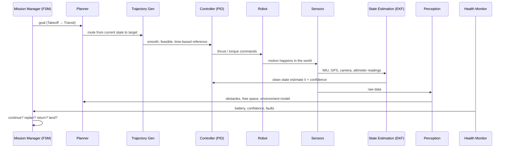

# The Autonomy Stack

**Hub note**: every vault topic as one closed-loop block diagram. [Introduction to Robotics & Autonomy](introduction.md) gives Sense–Think–Act; [Automation vs Autonomy](automation-vs-autonomy.md) gives *why*; this shows *how blocks connect* and how a fault propagates.

## Master block diagram

Each arrow = a dependency + interface. **Down the left** = commands (decide → plan → shape → control → act); **up the right** = knowledge (measure → estimate → interpret → inform). Robustness watches all.

## Acting vs Knowing

| | **Acting** ("what to do + make happen") | **Knowing** ("what's true") |
|---|---|---|
| Blocks | FSM, Planning, Trajectory, Control | Sensors, Estimation, Perception |
| Notes | [Mission Logic & FSM](../autonomy/mission-fsm.md), [Planning & Navigation](../autonomy/planning.md), [Trajectory Generation & Tracking](../autonomy/trajectory.md), [Control Systems & PID](../autonomy/control-pid.md) | [Sensors & State Estimation](../autonomy/state-estimation.md), [Perception](../autonomy/perception.md) |

Inside Knowing: **estimation** = "where am *I*?" (self pose/velocity); **perception** = "what's *around* me?" (obstacles/free space). Both rest on [State-Space Modeling](../autonomy/state-space.md).

## Integration / Robustness = supervisor

[System Integration & Robustness](../autonomy/integration-robustness.md) sits **above** the chain, not in it. Ingests health/confidence; watches **delay, stale data, frame mismatch, saturation, faults**; feeds supervision/fallback/emergency to the FSM. Ensures locally-correct modules → **globally safe** system.

## Closed loop in words

Act (Control→Robot) → world responds → sensors measure → estimation cleans to a state → perception interprets → flows up to planning/FSM → decide next. **Never runs open**; each tick = one trip around the cycle.

## Quadcopter mission (time-ordered)

## Cross-topic dependencies (gotchas)

A weak block **silently corrupts** those downstream:

| Weak block | Damages | Why |
|------------|---------|-----|
| **Estimation** | Control + Planning | both consume `x̂`; wrong state → track/plan from wrong place |
| **Perception** | Navigation | missed obstacle routed straight through |
| **Planning** | Trajectory | bad route → dynamically impossible trajectory |
| **Mission logic** | whole mission | bad decisions continue a doomed mission |
| **Integration** | everything | weak supervision makes good modules unsafe |

**Lesson**: a correct-in-isolation module still crashes on stale data, wrong frame, or no fallback. **Correctness must be defined at the integrated-system level, under uncertainty/degradation** — remit of [System Integration & Robustness](../autonomy/integration-robustness.md).

## Where each block lives

- **Decide:** [Mission Logic & FSM](../autonomy/mission-fsm.md)
- **Route:** [Planning & Navigation](../autonomy/planning.md)
- **Shape:** [Trajectory Generation & Tracking](../autonomy/trajectory.md)
- **Act:** [Control Systems & PID](../autonomy/control-pid.md)
- **Estimate:** [Sensors & State Estimation](../autonomy/state-estimation.md)
- **Understand:** [Perception](../autonomy/perception.md)
- **Model:** [State-Space Modeling](../autonomy/state-space.md)
- **Supervise:** [System Integration & Robustness](../autonomy/integration-robustness.md)

## Related

- [Introduction to Robotics & Autonomy](introduction.md)
- [Automation vs Autonomy](automation-vs-autonomy.md)
- [Control Systems & PID](../autonomy/control-pid.md)
- [Sensors & State Estimation](../autonomy/state-estimation.md)
- [Trajectory Generation & Tracking](../autonomy/trajectory.md)
- [Perception](../autonomy/perception.md)
- [Planning & Navigation](../autonomy/planning.md)
- [Mission Logic & FSM](../autonomy/mission-fsm.md)
- [State-Space Modeling](../autonomy/state-space.md)
- [System Integration & Robustness](../autonomy/integration-robustness.md)

## Handbook references
- *Underactuated Robotics* — [Output Feedback (Pixels-to-Torques)](https://underactuated.csail.mit.edu/output_feedback.html)
- *Robotic Manipulation* — [Introduction](https://manipulation.csail.mit.edu/intro.html)
