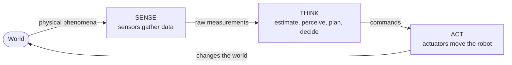

# Introduction to Robotics & Autonomy

On-ramp to [The Autonomy Stack](autonomy-stack.md) and the [Automation vs Autonomy](automation-vs-autonomy.md) split.

## What is a robot?

Working definition: **an embodied agent programmed to perform physical tasks.** No universal definition exists; competing emphases:

| Source | Emphasis |
|--------|----------|
| Dictionary | programmability + automation |
| Robotics Industries Assoc. | reprogrammable industrial **manipulator** |
| IEEE | **autonomy** — sense, compute, act |

**Better than yes/no**: grade *degree of roboticity*.

## Degrees of roboticity

| Axis | Low → High |
|------|-----------|
| **Embodiment** | software → physical body |
| **Autonomy** | teleoperated → self-governing |
| **Complexity** | single reflex → multi-stage missions |
| **Programmability** | fixed-function → freely re-taskable |

Thermostat: high autonomy, ~zero complexity. Chess engine: complex, **not embodied**. Drone: scores on all four.

## Robotics vs AI — embodiment is the line

- **Robot** = embodied; real, irreversible physical consequences.
- **AI** need not be embodied (Go, translation, face ID).
- **Why embodiment is hard**: noisy sensors, imperfect actuators, real-time deadlines, energy limits, world won't pause. → [Automation vs Autonomy](automation-vs-autonomy.md), [System Integration & Robustness](../autonomy/integration-robustness.md).

## Inter-disciplinary synthesis

AI (decisions), Computer Vision ([Perception](../autonomy/perception.md)), ML (learned models), Control Theory ([Control Systems & PID](../autonomy/control-pid.md)), Electronics/Mechanical ([Mechanical Configuration & Actuation](../hardware/mechanical-configuration.md)), Systems Engineering ([System Integration & Robustness](../autonomy/integration-robustness.md)). Course bias: **pragmatic mobile robotics**.

## Anatomy: Sense–Think–Act

| Part | Role | Examples |
|------|------|----------|
| **Sensors** | acquire info | IMU, camera, GPS, LiDAR ([Sensors & State Estimation](../autonomy/state-estimation.md)) |
| **Computation** | data → decisions | estimator, planner, controller |
| **Actuators** | act on world | motors, rotors, wheels, grippers |

**Loop never opens**: act → world changes → sense → react → repeat. Full elaboration in [The Autonomy Stack](autonomy-stack.md).

## History (1-liners)

| When | Milestone |
|------|-----------|
| 1920 | Čapek's *R.U.R.* coins **"robot"** (Czech *robota* = labor) |
| ~1950s | **Unimate** — first industrial robot |
| 1960s→ | robotics becomes an academic discipline |

Word born in **fiction**, means **labor** — that "repeat labor" vs "decide yourself" tension *is* the [Automation vs Autonomy](automation-vs-autonomy.md) split.

## State of the art

- **Mars Rovers** — light-speed delay forbids real-time teleop → bounded, mission-specific local autonomy.
- **DARPA 2005 "Stanley"** — 175 mi desert course fully autonomous; launched modern self-driving.

## Why hard, why it matters

- **Hard**: open, noisy, unforgiving world; sensors lie, actuators slip, models approximate, no undo. Integration is the core challenge ([System Integration & Robustness](../autonomy/integration-robustness.md)).
- **Matters**: big economic/social stakes; deep ties to AI/ML/control/vision/optimization.

## Organizing the field

| Principle | Trade-off |
|-----------|-----------|
| **By application** (aerial, medical, humanoid, industrial) | intuitive, hides shared structure |
| **By concept** (estimation, control, planning, perception) | reveals shared challenges |

This vault is **concept-first**: learn ideas once, apply across domains. Project themes: drone delivery, GPS-denied indoor nav, autonomous exploration, precision landing — each a slice through sense → estimate → perceive → plan → trajectory → control → mission, supervised for robustness.

## Related

- [Automation vs Autonomy](automation-vs-autonomy.md)
- [The Autonomy Stack](autonomy-stack.md)
- [Sensors & State Estimation](../autonomy/state-estimation.md)
- [Perception](../autonomy/perception.md)
- [Control Systems & PID](../autonomy/control-pid.md)
- [Planning & Navigation](../autonomy/planning.md)
- [Mission Logic & FSM](../autonomy/mission-fsm.md)
- [System Integration & Robustness](../autonomy/integration-robustness.md)

## Handbook references
- *Underactuated Robotics* — [Fully-actuated vs Underactuated Systems](https://underactuated.csail.mit.edu/intro.html)
- *Robotic Manipulation* — [Introduction](https://manipulation.csail.mit.edu/intro.html)
