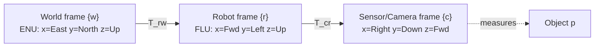

# Coordinate Frames & Transforms

**Why this note exists.** A coordinate by itself is **meaningless** — "the obstacle is at (5, 5)" only has meaning once you say *(5, 5) in which frame?*. Every number a robot stores or shares is really a triple of **value + frame + units** (and, in a running system, a timestamp and an uncertainty too). This note builds the algebra that lets a robot say where things are, convert between the many frames it juggles, and chain those conversions without losing track of *whose* coordinates it is holding. It underpins almost everything downstream: [Rotations & Orientation](rotations.md), [Pose & Kinematics](../kinematics/pose-kinematics.md), [Perception](../autonomy/perception.md), [Sensors & State Estimation](../autonomy/state-estimation.md), and [Forward & Inverse Kinematics](../kinematics/forward-inverse-kinematics.md).

---

## 1. Coordinate frames

A **coordinate frame** is a set of orthogonal axes attached to a body, meeting at a single point called the **origin**, that lets you describe the position of points relative to that body. In robotics we attach a frame to:

- **the robot** (robot/body frame "r" or "B"),
- **each sensor** on the robot (e.g. camera frame "c" or "C"),
- **a fixed location in the world** (world frame "w" or "W"),
- **external bodies** (other robots, tracked objects).

In manipulation the robot is articulated, so one frame is attached to **each link** — exactly the setup used in [Forward & Inverse Kinematics](../kinematics/forward-inverse-kinematics.md).

### Right-handedness and the right-hand rule

Robotics uses **right-handed** frames. Mnemonics for axes x, y, z:

- **Thumb = z**: point your right thumb along +z; the curl of your fingers sweeps from +x toward +y.
- **Index = x, middle = y, thumb = z** on the right hand.
- (Left-hand check: index = y, middle = x, thumb = z.)

Right-handedness is the same property that forces **x × y = z** and **det(R) = +1** for rotation matrices (see [Rotations & Orientation](rotations.md)).

### Standard frame conventions

| Frame | Origin | Axes |
|-------|--------|------|
| **Robot / body (FLU)** | center of mass | x **forward**, y **left**, z **up** |
| **Camera (3D)** | optical center | x **right**, y **down**, z **forward** (into the scene) |
| **Image (2D)** | top-left of the image | x right, y down (pixels) |
| **World (ENU)** | fixed point in environment | x **East**, y **North**, z **Up** |

Two clashes that bite beginners: the **robot frame is FLU** (Forward-Left-Up) while the **global frame is often ENU** (East-North-Up), and the **camera frame** (x-right, y-down, z-forward) is rotated relative to both. A reading is only sensible after it has been moved into the right frame — *"choose your reference frame carefully and the math gets easier."*

The robot moves in the world, tracks objects it senses, and tracks its own appendages — all three are frame-to-frame conversions along this chain.

---

## 2. Points, positions, and translations

Once a frame is fixed, a 3D point is just a vector of its projections onto the axes:

    p_w = [p_x, p_y, p_z]ᵀ   (coordinates of p in frame w)

**Displacement / translation** between two points is vector subtraction, and the reverse is **composition**:

    p_12 = p_2 − p_1        (displacement from point 1 to point 2)
    p_2  = p_1 + p_12       (composition)
    p_12 = −p_21            (inverse)

Notation matters: a **single subscript** (p_1) is a position relative to the frame origin; a **double subscript** (p_12) is a translation *between two points*. The **superscript w is never dropped** — these vectors are meaningless without naming the frame they live in. We work in ℝ² for planar problems and ℝ³ for 3D.

This turns geometry into linear algebra, which is the whole point: positions, displacements, and orientations all become matrix/vector operations a computer can chain.

---

## 3. Pose = rotation + translation

A rigid body's full configuration is its **pose**: where its frame's origin sits **and** how its axes are turned. If `t_r^w` is the position of frame r's origin expressed in w, and `R_r^w` is the orientation of r with respect to w (see [Rotations & Orientation](rotations.md)), then the pair

    pose of r in w = (R_r^w, t_r^w)

fully characterizes r relative to w. A pose has **6 degrees of freedom**: 3 translation + 3 rotation.

### Homogeneous coordinates and the 4×4 transform

Carrying R and t separately is clumsy when you start chaining frames. The trick is to **augment** a 3D point with a trailing 1 (its **homogeneous** form) and pack R and t into a single 4×4 matrix:

    p̃ = [p; 1]            (homogeneous point)

           ┌ R   t ┐
    T_r^w = │       │      (4×4 rigid-body transform)
           └ 0ᵀ  1 ┘

Then a rigid-body transform — **rotate first, then translate** — is one matrix product:

    p_w = R_r^w · p_r + t_r^w        ⟺        p̃_w = T_r^w · p̃_r

This generalizes the pure-rotation case p_w = R·p_r to frames that **do not share an origin**.

### SE(2) and SE(3)

The set of all such transforms (rotation + translation, no scaling or shearing) is the **Special Euclidean group** — **SE(2)** in the plane (a 3×3 matrix, 3 DoF) and **SE(3)** in 3D (a 4×4 matrix, 6 DoF). It is exactly the set of **rigid motions**: distances and angles are preserved. Bundling rotation and translation into one SE(2)/SE(3) matrix is what makes composition and inversion clean.

---

## 4. Composition and inverse of poses

The same chain-rule logic that composed displacements composes whole poses — by **matrix multiplication**:

    T_c^w = T_r^w · T_c^r        (pose of c in w, via r)

Read the indices like dominoes: the **subscript of the first** must match the **superscript of the second** (…r · c^r → c^w). As with rotations, **composition is not commutative**: T_r^w · T_c^r ≠ T_c^r · T_r^w in general.

The **inverse** of a pose is *not* just a transpose (that shortcut works only for pure rotation matrices, which are orthogonal — see [Rotations & Orientation](rotations.md)). For a full 4×4 transform:

           ┌ Rᵀ   −Rᵀ·t ┐
    T_w^r = │             │ = (T_r^w)⁻¹
           └ 0ᵀ      1   ┘

The rotation block is transposed, but the translation must be **rotated by Rᵀ and negated** — because undoing a rigid motion means undoing the rotation *and* moving the (now re-rotated) offset back. Forgetting this is a classic frame bug.

---

## 5. Worked example — drone body + mounted camera (extrinsics)

A drone carries a camera rigidly bolted below it. Three frames: **W** (world), **B** (drone body), **C** (camera). The drone's pose in the world is `(R_wb, t_wb)`. For any point seen in body coordinates:

    p_W = R_wb · p_B + t_wb        (rotate first, then translate)

The camera mount — the fixed **extrinsics** of the camera in the body — is `(R_bc, t_bc)`. To get the **camera's pose in the world** we compose the two poses:

    R_wc = R_wb · R_bc
    t_wc = R_wb · t_bc + t_wb

**The subtle, load-bearing point:** the offset `t_bc` must be **rotated by R_wb first**, then added to `t_wb`. Writing `t_wc = t_bc + t_wb` (forgetting the rotation) is wrong — it ignores that the body-frame mount offset points in different world directions depending on how the drone is oriented. Concretely: **change only the drone's yaw and the camera's world position moves**, even though the mount numbers `(R_bc, t_bc)` never changed. This is exactly pose composition `T_wc = T_wb · T_bc` written out block by block.

**Why it matters.** Wrong extrinsics → every pixel-derived object lands in the wrong world location → a corrupted map. This is the [Perception](../autonomy/perception.md) failure mode "wrong frame transform is as dangerous as a wrong measurement," and it is why [System Integration & Robustness](../autonomy/integration-robustness.md) insists every value travel with its reference frame.

---

## 6. Transforming a sensor reading up the chain

Putting it together: a sensor measures an object in **sensor coordinates** `p_s`. To express it where the planner and map live (world coordinates), walk the chain frame by frame:

    p_r = T_s^r · p_s        (sensor → robot)
    p_w = T_r^w · p_r        (robot → world)

or in one shot `p_w = T_r^w · T_s^r · p_s = T_s^w · p_s`. The same machinery answers "where is this obstacle in robot coordinates so I can avoid it?" and "where is it in world coordinates so I can put it on the map?" — the two questions [Perception](../autonomy/perception.md) and [Planning & Navigation](../autonomy/planning.md) constantly ask. It is also how a robot keeps track of its own appendages, the link-by-link version handled in [Forward & Inverse Kinematics](../kinematics/forward-inverse-kinematics.md).

---

## Related

- [Rotations & Orientation](rotations.md) — the R block of every transform: rotation matrices, RPY, axis-angle, quaternions.
- [Pose & Kinematics](../kinematics/pose-kinematics.md) — adds time: how pose evolves into motion for mobile robots and drones.
- [Forward & Inverse Kinematics](../kinematics/forward-inverse-kinematics.md) — chaining link frames with DH parameters for manipulators.
- [Perception](../autonomy/perception.md) — sensor data lands in the map only after correct frame transforms.
- [Sensors & State Estimation](../autonomy/state-estimation.md) — every estimate carries value + frame + timestamp + uncertainty.
- [System Integration & Robustness](../autonomy/integration-robustness.md) — frame mismatch as a top real-world failure source.
