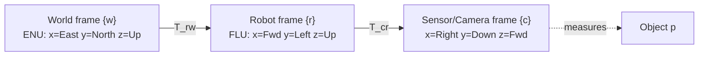

# Coordinate Frames & Transforms

A coordinate is **meaningless without a frame**: every value = **value + frame + units** (+ timestamp + uncertainty in a live system). Underpins [Rotations & Orientation](rotations.md), [Pose & Kinematics](../kinematics/pose-kinematics.md), [Perception](../autonomy/perception.md), [Sensors & State Estimation](../autonomy/state-estimation.md), [Forward & Inverse Kinematics](../kinematics/forward-inverse-kinematics.md).

---

## 1. Coordinate frames

**Frame**: orthogonal axes through an **origin**, attached to a body. Robotics attaches one to: robot/body (r/B), each sensor (camera c/C), the world (w/W), external bodies, and **each link** in manipulators ([Forward & Inverse Kinematics](../kinematics/forward-inverse-kinematics.md)).

**Right-handed** always: thumb=+z, fingers curl +x→+y; index=x, middle=y, thumb=z. Same property as **x × y = z** and **det(R) = +1** ([Rotations & Orientation](rotations.md)).

| Frame | Origin | Axes |
|-------|--------|------|
| **Robot/body (FLU)** | center of mass | x fwd, y left, z up |
| **Camera (3D)** | optical center | x right, y down, z fwd |
| **Image (2D)** | top-left | x right, y down (pixels) |
| **World (ENU)** | fixed point | x East, y North, z Up |

**Gotcha**: robot=FLU but world often=ENU, and camera (x-right, y-down, z-fwd) is rotated relative to both. A reading only makes sense after moving it into the right frame.

---

## 2. Points, positions, translations

Point in frame w: `p_w = [p_x, p_y, p_z]ᵀ`.

- Displacement: `p_12 = p_2 − p_1`
- Composition: `p_2 = p_1 + p_12`
- Inverse: `p_12 = −p_21`

**Notation**: single subscript `p_1` = position vs origin; double `p_12` = translation between points. **Never drop the frame superscript.** ℝ² planar, ℝ³ 3D.

---

## 3. Pose = rotation + translation

**Pose of r in w** = `(R_r^w, t_r^w)` — orientation + origin position. **6 DoF** (3 translation + 3 rotation).

**Homogeneous form**: augment point with trailing 1, pack R and t into 4×4:

    p̃ = [p; 1]

           ┌ R   t ┐
    T_r^w = │       │
           └ 0ᵀ  1 ┘

Rigid transform (**rotate first, then translate**) = one product:

    p_w = R_r^w · p_r + t_r^w   ⟺   p̃_w = T_r^w · p̃_r

**SE(2)** = 3×3, 3 DoF (plane); **SE(3)** = 4×4, 6 DoF — the **rigid motions** (preserve distances/angles, no scale/shear).

---

## 4. Composition & inverse

    T_c^w = T_r^w · T_c^r

**Domino rule**: subscript of first = superscript of second. **Not commutative.**

Inverse is **not** just a transpose (that only works for pure rotations):

           ┌ Rᵀ   −Rᵀ·t ┐
    T_w^r = │             │ = (T_r^w)⁻¹
           └ 0ᵀ      1   ┘

**Gotcha**: translation must be **rotated by Rᵀ and negated**. Forgetting it = classic frame bug.

---

## 5. Worked example — drone body + camera (extrinsics)

Frames W, B, C. Drone pose `(R_wb, t_wb)`; mount extrinsics `(R_bc, t_bc)`. Camera pose in world:

    R_wc = R_wb · R_bc
    t_wc = R_wb · t_bc + t_wb

**Load-bearing point**: rotate `t_bc` by `R_wb` *before* adding. `t_wc = t_bc + t_wb` is **wrong** — change only yaw and the camera's world position moves, though mount numbers never changed. This is just `T_wc = T_wb · T_bc` block-by-block.

**Gotcha**: wrong extrinsics → every pixel-derived object lands wrong → corrupted map. The [Perception](../autonomy/perception.md) rule "wrong frame ≈ wrong measurement"; why [System Integration & Robustness](../autonomy/integration-robustness.md) ships a frame with every value.

---

## 6. Sensor reading up the chain

    p_r = T_s^r · p_s   (sensor → robot)
    p_w = T_r^w · p_r   (robot → world)

One shot: `p_w = T_r^w · T_s^r · p_s = T_s^w · p_s`. Answers both "where is the obstacle in robot coords (avoid)?" and "in world coords (map)?" — the questions [Perception](../autonomy/perception.md) and [Planning & Navigation](../autonomy/planning.md) ask. Link-by-link version: [Forward & Inverse Kinematics](../kinematics/forward-inverse-kinematics.md).

---

## Related

- [Rotations & Orientation](rotations.md) — the R block of every transform: rotation matrices, RPY, axis-angle, quaternions.
- [Pose & Kinematics](../kinematics/pose-kinematics.md) — adds time: how pose evolves into motion for mobile robots and drones.
- [Forward & Inverse Kinematics](../kinematics/forward-inverse-kinematics.md) — chaining link frames with DH parameters for manipulators.
- [Perception](../autonomy/perception.md) — sensor data lands in the map only after correct frame transforms.
- [Sensors & State Estimation](../autonomy/state-estimation.md) — every estimate carries value + frame + timestamp + uncertainty.
- [System Integration & Robustness](../autonomy/integration-robustness.md) — frame mismatch as a top real-world failure source.

## Handbook references
- *Robotic Manipulation* — [Spatial Algebra (Appendix A)](https://manipulation.csail.mit.edu/spatial.html) · [Basic Pick and Place](https://manipulation.csail.mit.edu/pick.html)
