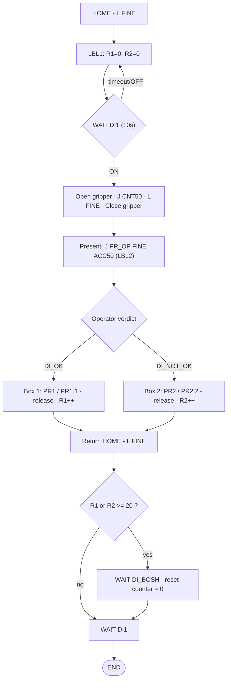

# Robot Programming & Manipulators

Industrial arms aren't hand-tuned with PID by the user — they're **programmed** in a line-numbered **teach-pendant (TP) language** over the controller. Programmer specifies *where*, *how*, *how fast*, *how precisely to stop*, *what logic* in between (I/O, counters, branches); the motion planner + servo loops realise it.

---

## 1. What a program is

Sequence of numbered-line commands, three instruction kinds:

- **Motion** — format, target, speed, positioning path.
- **Logic / control flow** — `IF`, `JMP/LBL`, `CALL/END`, `WAIT`, `FOR`.
- **Data & I/O** — registers, position registers, digital signals.

Ends with **END**. Structured app = **main** + **subprograms** (reusable actions like open-gripper).

---

## 2. Motion instructions

Four parts: **format** (trajectory), **position**, **speed**, **positioning path**. Optional **additional** instruction (e.g. accel override) rides along.

| Format | Letter | Trajectory |
|--------|--------|-----------|
| **Joint** | **J** | All axes start/stop together; curved path in joint space. Fastest, path doesn't matter. |
| **Linear** | **L** | TCP straight line start→end (also pure reorientation). |
| **Circular** | **C** | Arc through a via point; via + end on **one line**. |
| **Arc** | **A** | Arc, **one position per line**; controller chains successive A points. |

**Speed:** joint = % 1–100 of max (or time); linear/circ/arc = absolute (e.g. 1–2000 mm/s), or deg/s for reorientation, or time.

---

## 3. Termination — FINE vs CNT

- **FINE** — **stops exactly** at the point. Use at pick/drop (accuracy).
- **CNT (continuous)** — **doesn't stop**, rounds the corner. Coefficient 0–100:
  - **CNT0** — passes closest (tightest corner), still no stop.
  - **CNT100** — widest path, never slows.
  - **CNT50** — typical smooth transit.

---

## 4. Speed, accel & data

- **ACCxx** — additional instruction scaling accel/decel (ACC50 = half) for fragile loads/wear. Others: Skip, Offset, Tool_Offset, INC, BREAK.
- **Registers `R[i]`** — numeric vars; counters + arithmetic (`+ − × ÷`).
- **Position registers `PR[i]`** — hold `(x, y, z, w, p, r)`; assignable, summable, reusable (vs hard-coded points). `PR[i, j]` = one coordinate.
- **Digital I/O** — `DI[n]` reads sensor/operator signals; `DO[n]` drives devices. Cell handshake.

---

## 5. Flow control & structure

| Instruction | Meaning |
|-------------|---------|
| **END** | Program end; if CALLed, returns to caller. |
| **LBL[i]** | Label (return point). |
| **JMP LBL[i]** | Unconditional jump. |
| **CALL** | Jump to subprogram first line; END returns after CALL. |
| **WAIT** | Suspend for time or until condition (e.g. DI), optional timeout branch. |
| **IF** | Single-line conditional branch. |
| **IF_THEN … ELSE … ENDIF** | Block conditional; THEN/ELSE mutually exclusive. |
| **FOR … ENDFOR** | Counted loop (auto-matched). |
| **R[i] / PR[i]** | Register / position-register assign + arithmetic. |
| **DI[n] / DO[n]** | Read input / set output. |
| **J / L / C / A** | Motion formats (§2). |
| **FINE / CNTxx** | Termination (§3). |
| **ACCxx** | Accel override (§4). |

**Structure:** **main** (init positions, loop work cycle, handle HMI) **CALLs subprograms** for discrete actions. Labels/JMPs give cyclic signal-driven structure; registers carry state across cycles.

---

## 6. Worked scenario — SCARA QC

**Task.** 4-DOF RRTR SCARA does quality control. Cell: production line, operator post (OK/NOT-OK panel), two boxes. Cycle: pick arriving product → present to operator → on **OK** → box 1, on **NOT-OK** → box 2 → return. Counts each box, resets at **20** (waits for "empty box" signal).

**Kinematics.** RRTR = Revolute, Revolute, Translational (prismatic), Revolute. Two revolutes sweep horizontal plane; prismatic (var `d`) = vertical pick/place stroke; final revolute orients gripper. SCARA: rigid vertical, compliant horizontal.

| Joint | Type | θ (z) | d (z) | α (x) | a (x) |
|-------|------|-------|-------|-------|-------|
| 0–1 | R | θ₁ = 0 | 0.3 | 0 | 0.2 |
| 1–2 | R | θ₂ = 0 | 0.1 | 180° | 0.15 |
| 2–3 | T | 0 | **Var** | 0 | 0.2 |
| 3–4 | R | θ₃ = 0 | 0.1 | 0 | 0 |

FK: `S = A₁·A₂·A₃·A₄` (see [Forward & Inverse Kinematics](../kinematics/forward-inverse-kinematics.md)); prismatic **Var** `d` = commanded vertical depth.

**Program logic.**

1. **Init.** L move from HOME at full speed, **FINE**. Set LBL[1]; zero counters `R[1]`, `R[2]`.
2. **Wait start.** WAIT ≤10 s for `DI[1]`; if OFF, JMP LBL[1] (timeout guard).
3. **Pick.** CALL open-gripper → J approach at half speed **CNT50** → L to grasp **FINE** → CALL close-gripper → L retreat **CNT0**.
4. **Present.** J to `PR[OP]` half speed **FINE** **ACC50** (gentle). Set LBL[2].
5. **Sort (IF_THEN/ELSE/ENDIF on verdict):**
   - **IF `DI[OK]`** → J to box-1 `PR[1]` full **CNT50** → drop `PR[1.1]` half **FINE** → CALL open-gripper → retract `PR[1]` **CNT50** → `R[1]++`.
   - **ELSE IF `DI[NOT_OK]`** → mirror to `PR[2]`/`PR[2.2]`, release, `R[2]++`. ENDIF.
6. **Return & gate.** L to HOME full **FINE** → WAIT next `DI[1]`.
7. **Reset at 20.** IF `R[i] ≥ 20` → WAIT `DI[BOSH]` (empty box) → reset counter to 0 → WAIT start → END.

**Key ideas.**

- **Labels + JMP** → cyclic, signal-gated structure.
- **WAIT-for-signal** → syncs with cell + human; never acts on stale state.
- **Conditional branch** → routes same part to different destinations on live DI.
- **Registers as counters** → state across cycles; reset-at-20 bookkeeping (a continuous controller can't).
- **Position registers** → reusable/offsettable points vs hard-coded.
- **FINE vs CNT** → FINE at grasp/drop, CNT on transit; ACC softens present move.

The TP program is a small FSM in pendant syntax — discrete mission logic over continuous motion (see [Mission Logic & FSM](../autonomy/mission-fsm.md)).

---

## Related

- [Forward & Inverse Kinematics](../kinematics/forward-inverse-kinematics.md) — the DH table and `S = A₁·A₂·A₃·A₄` chain that the motion instructions ultimately command.
- [Mechanical Configuration & Actuation](mechanical-configuration.md) — gripper open/close and the prismatic vertical stroke are actuated motions.
- [Mission Logic & FSM](../autonomy/mission-fsm.md) — labels/waits/branches/counters are a teach-pendant FSM over the work cycle.
- [Trajectory Generation & Tracking](../autonomy/trajectory.md) — J/L/C/A formats and FINE/CNT/ACC shape the executed trajectory.
- [Control Systems & PID](../autonomy/control-pid.md) — the servo loops that realise each commanded point beneath the program.

## Handbook references
- *Robotic Manipulation* — [Let's get you a robot](https://manipulation.csail.mit.edu/robot.html) · [Basic Pick and Place](https://manipulation.csail.mit.edu/pick.html)
