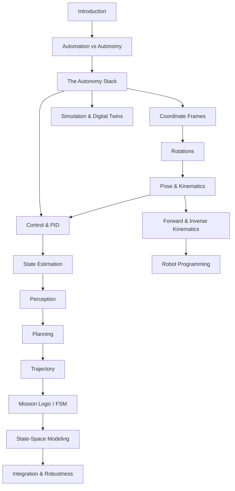

# Robotics

A theory reference for *Elements of Robotics & Automation*, split into linked topic notes and grouped into sections. Start here and follow the links.

!!! note "Primary sources"
    These notes track two MIT textbooks by Russ Tedrake — every topic note links the relevant chapters under its **Handbook references** section:

    - **Underactuated Robotics** — <https://underactuated.csail.mit.edu/>
    - **Robotic Manipulation** — <https://manipulation.csail.mit.edu/>

!!! tip "The hub note"
    The single most connected note is **[The Autonomy Stack](foundations/autonomy-stack.md)** — it shows the full sense → think → act loop and links out to every building block.

## Sections

- **[Foundations](foundations/index.md)** — what a robot is, automation vs autonomy, the master control loop.
- **[Geometry & Spatial Math](geometry/index.md)** — frames, transforms, rotations, quaternions.
- **[Kinematics](kinematics/index.md)** — pose over time, forward/inverse kinematics, DH parameters.
- **[Hardware & Programming](hardware/index.md)** — hydraulic/pneumatic actuation, teach-pendant programming.
- **[Autonomy Stack — Modules](autonomy/index.md)** — control, estimation, perception, trajectory, planning, mission logic, modeling, robustness.
- **[Tooling](tooling/index.md)** — simulation and the sim-to-real bridge.

## The autonomy stack at a glance

| Block | Note | Answers |
|-------|------|---------|
| Control | [Control Systems & PID](autonomy/control-pid.md) | how do I make the robot follow a reference? |
| Estimation | [Sensors & State Estimation](autonomy/state-estimation.md) | where am *I*, and how sure am I? |
| Perception | [Perception](autonomy/perception.md) | what is *around* me? |
| Trajectory | [Trajectory Generation & Tracking](autonomy/trajectory.md) | how do I move there *feasibly*? |
| Planning | [Planning & Navigation](autonomy/planning.md) | which *route* do I take? |
| Mission logic | [Mission Logic & FSM](autonomy/mission-fsm.md) | what should I do *next*? |
| Modeling | [State-Space Modeling](autonomy/state-space.md) | how does the system *evolve*? |
| Robustness | [System Integration & Robustness](autonomy/integration-robustness.md) | how does it stay safe when things break? |

## Suggested reading order

