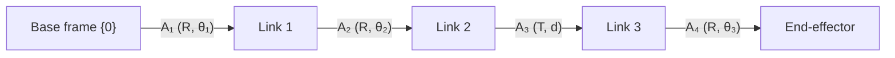

# Forward & Inverse Kinematics

**Why this note exists.** This note covers **robot arms and manipulators** — chains of rigid **links** joined by **joints**, ending in an **end-effector** (gripper, tool). Where [Pose & Kinematics](pose-kinematics.md) tracked a single rigid body flying through the world, here the body is *articulated*: many frames, one per link, that must be composed to find where the hand ends up. **Robot kinematics** is the study of how robots move their links and end-effectors, and it enables the design, control, and programming of robots to perform tasks with precision. Two directions of this question define the field, and they sit underneath path planning, control, collision avoidance, and programming — the application side lives in [Robot Programming & Manipulators](../hardware/robot-programming.md).

---

## 1. Forward vs inverse kinematics

| | **Forward kinematics (FK)** | **Inverse kinematics (IK)** |
|---|------------------------------|------------------------------|
| **Given** | joint angles / displacements | desired end-effector pose |
| **Find** | end-effector position & orientation | joint angles / displacements that achieve it |
| **Nature** | one direct answer (compose the link transforms) | may have **many, one, or no** solutions |
| **Use** | "where is the hand if joints are at these values?" | "what joint values put the hand *here*?" |

- **Forward kinematics** computes the **position and orientation of the end-effector from the joint angles** — it describes how the joints move the end-effector through space. It is a direct calculation: chain the per-link transforms.
- **Inverse kinematics** goes the other way: **find the joint angles that achieve a desired end-effector pose**. This is what you need to make a robot *reach a specific point* or *follow a trajectory*, and it is generally harder — nonlinear, possibly with multiple valid arm configurations (elbow-up vs elbow-down) or none at all if the target is out of reach.

A frame is attached to each articulated part so every link has unique coordinates and a reference for computing rotations and positioning — exactly the multi-frame setup foreshadowed in [Coordinate Frames & Transforms](../geometry/coordinate-frames.md).

---

## 2. Denavit–Hartenberg (DH) parameters

The **Denavit–Hartenberg (DH) matrix** is the standard, minimal way to describe the rigid-body transformation **between two adjacent links** of an arm. Instead of a full 6-DoF pose per joint, DH cleverly captures each link-to-link transform with just **four parameters**:

| Parameter | Axis | Meaning |
|-----------|------|---------|
| **θ** | about z | joint **rotation angle** about the z-axis |
| **d** | along z | **offset / length** along the z-axis |
| **a** | along x | link **length** along the x-axis |
| **α** | about x | link **twist** about the x-axis |

The convention fixes the axes per link: **z is the joint axis**, and **x points along the common normal** of the previous link. The crucial distinction between joint *types*:

- **Revolute (rotational) joint** — the z-axis is **perpendicular to the joint**; the joint **rotates about z**, so **θ is the variable** and d is fixed.
- **Prismatic (translational) joint** — the z-axis is **parallel to the link**; the link **slides along z**, so **d is the variable** and θ is fixed.

Each link's four DH parameters assemble into a 4×4 homogeneous transform `A_i` (a member of SE(3), exactly the matrices of [Coordinate Frames & Transforms](../geometry/coordinate-frames.md)). **Forward kinematics is then just pose composition** — multiply the link transforms from base to tip:

    S = A₁ · A₂ · A₃ · A₄

This single product `S` gives the end-effector's pose relative to the base. The order matters and is not commutative — the same chain rule as composing any poses.

---

## 3. Worked example — SCARA / RRTR arm

A **4-DOF RRTR** arm (the SCARA layout) doing pick-and-place quality control. **RRTR = Revolute, Revolute, Translational (prismatic), Revolute**: two revolute joints swing the arm horizontally, the prismatic joint moves the tool vertically for pick/place, and a final revolute joint orients the gripper. Its DH table:

| Joint | Type | θ (about z) | d (along z) | α (about x) | a (along x) |
|-------|------|-------------|-------------|-------------|-------------|
| 0–1 | **R** (revolute) | θ₁ (variable) | 0.3 | 0 | 0.2 |
| 1–2 | **R** (revolute) | θ₂ (variable) | 0.1 | 180° | 0.15 |
| 2–3 | **T** (prismatic) | 0 | **d (variable)** | 0 | 0.2 |
| 3–4 | **R** (revolute) | θ₃ (variable) | 0.1 | 0 | 0 |

Reading the table: the **revolute** joints vary **θ** (their d is a fixed offset), while the **prismatic** joint holds θ fixed and varies **d** — that variable `d` is precisely the vertical pick/place travel. The **α = 180°** on joint 1–2 flips the frame, characteristic of the SCARA geometry, which keeps the arm **rigid vertically and compliant horizontally** (ideal for inserting parts). The end-effector pose follows from the product

    S = A₁ · A₂ · A₃ · A₄        (forward kinematics)

To instead command the arm to a target pose, you solve the **inverse** problem for (θ₁, θ₂, d, θ₃). The application — teaching this arm to pick, present to an operator, and sort OK/NOT-OK into boxes via a teach-pendant program — is covered in [Robot Programming & Manipulators](../hardware/robot-programming.md).

---

## 4. From kinematics to dynamics

Kinematics describes motion **geometrically** (position, velocity, acceleration of links) without asking *what forces cause it*. **Dynamics** adds the forces and torques — essential for control, stability, and safety. For an arm with n joints the equations of motion take the canonical manipulator form:

    M(q)·q̈ + C(q, q̇)·q̇ + G(q) = τ

| Term | Name | Role |
|------|------|------|
| **M(q)** | mass / inertia matrix | resistance to acceleration (configuration-dependent) |
| **C(q, q̇)·q̇** | centripetal & **Coriolis** | velocity-coupling forces between joints |
| **G(q)** | gravity vector | torque needed just to hold the arm up against gravity |
| **q, q̇, q̈** | joint position, velocity, acceleration | the motion variables |
| **τ** | joint torque vector | the **actuator input** the controller commands |

This equation maps **torques the motors apply** to **how the joints accelerate**, and is the model a controller inverts to make the arm track a trajectory.

### Euler–Lagrange origin

These dynamics are derived with the **Euler–Lagrange** method, built from the **Lagrangian** `L = (kinetic energy) − (potential energy)`. Writing the kinetic energy (from link masses and velocities) minus the potential energy (from gravity) and applying the Euler–Lagrange equation per joint yields exactly the `M(q)q̈ + C(q,q̇)q̇ + G(q) = τ` form above — a systematic recipe that scales to any number of joints without drawing free-body diagrams.

---

## 5. Why kinematics matters in robotics

| Use | How kinematics serves it |
|-----|---------------------------|
| **Path planning** | plan the path the arm follows to reach its goal (in joint/configuration space) |
| **Control** | FK/IK and dynamics underpin control algorithms for accurate, smooth motion |
| **Collision avoidance** | knowing every link's pose lets you check the whole arm against obstacles, not just the tip |
| **Programming** | programmers use kinematic equations to define trajectories and movement tasks |

Forward kinematics tells you **where the arm is**; inverse kinematics tells you **how to get the hand where you want it**; dynamics tells you **what torques make it happen smoothly and safely**. Together they are the bridge from a desired task to the joint commands an arm actually executes — applied concretely in [Robot Programming & Manipulators](../hardware/robot-programming.md).

---

## Related

- [Robot Programming & Manipulators](../hardware/robot-programming.md) — the SCARA pick-and-place application and teach-pendant programming.
- [Coordinate Frames & Transforms](../geometry/coordinate-frames.md) — link frames, homogeneous 4×4 transforms, pose composition S = A₁···A₄.
- [Rotations & Orientation](../geometry/rotations.md) — elementary rotations underlying each DH link transform.
- [Pose & Kinematics](pose-kinematics.md) — the mobile-robot counterpart (single rigid body, pose + time → motion).
- [Control Systems & PID](../autonomy/control-pid.md) — control inverts the dynamics M(q)q̈ + C(q,q̇)q̇ + G(q) = τ.
- [Mechanical Configuration & Actuation](../hardware/mechanical-configuration.md) — joint types (revolute/prismatic) and the actuators that drive them.
