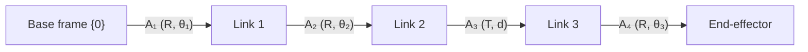

# Forward & Inverse Kinematics

Robot arms: chains of **links** + **joints** ending in an **end-effector**. Articulated body — one frame per link, composed to find the hand. Application side: [Robot Programming & Manipulators](../hardware/robot-programming.md).

---

## 1. FK vs IK

| | **Forward (FK)** | **Inverse (IK)** |
|---|---|---|
| **Given** | joint angles/displacements | desired end-effector pose |
| **Find** | end-effector pose | joint values achieving it |
| **Nature** | one answer (compose transforms) | **many, one, or no** solutions |
| **Question** | "where is the hand?" | "what joints put the hand *here*?" |

- **FK** = direct: chain per-link transforms.
- **IK** = nonlinear, harder; multiple configs (elbow-up/down) or none (out of reach).

One frame per link → unique coordinates, see [Coordinate Frames & Transforms](../geometry/coordinate-frames.md).

---

## 2. Denavit–Hartenberg (DH) parameters

Minimal link-to-link transform: **4 params** instead of full 6-DoF.

| Param | Axis | Meaning |
|-------|------|---------|
| **θ** | about z | joint rotation angle |
| **d** | along z | offset/length along z |
| **a** | along x | link length along x |
| **α** | about x | link twist about x |

Convention: **z = joint axis**, **x = common normal** of previous link.

- **Revolute** — rotates about z; **θ variable**, d fixed.
- **Prismatic** — slides along z; **d variable**, θ fixed.

Each link → 4×4 transform `A_i` ∈ SE(3). **FK = pose composition** base→tip:

    S = A₁ · A₂ · A₃ · A₄

Order matters (not commutative).

---

## 3. Example — SCARA / RRTR arm

**RRTR** = Revolute, Revolute, Translational (prismatic), Revolute. Two revolutes swing horizontally, prismatic moves tool vertically (pick/place), final revolute orients gripper.

| Joint | Type | θ (z) | d (z) | α (x) | a (x) |
|-------|------|-------|-------|-------|-------|
| 0–1 | R | θ₁ (var) | 0.3 | 0 | 0.2 |
| 1–2 | R | θ₂ (var) | 0.1 | 180° | 0.15 |
| 2–3 | T | 0 | **d (var)** | 0 | 0.2 |
| 3–4 | R | θ₃ (var) | 0.1 | 0 | 0 |

- Revolutes vary **θ**; prismatic varies **d** = vertical pick/place travel.
- **α = 180°** on 1–2 flips the frame (SCARA: rigid vertically, compliant horizontally — good for insertion).
- FK: `S = A₁·A₂·A₃·A₄`. IK solves for (θ₁, θ₂, d, θ₃).

---

## 4. To dynamics

Kinematics = geometry only (no forces). **Dynamics** adds forces/torques. Manipulator equation of motion:

    M(q)·q̈ + C(q, q̇)·q̇ + G(q) = τ

| Term | Name | Role |
|------|------|------|
| **M(q)** | mass/inertia matrix | resistance to acceleration |
| **C(q, q̇)·q̇** | centripetal & **Coriolis** | velocity-coupling between joints |
| **G(q)** | gravity | torque to hold arm up |
| **q, q̇, q̈** | joint pos/vel/accel | motion variables |
| **τ** | joint torque | **actuator input** |

Maps motor torques → joint accelerations; controller inverts it to track trajectories.

**Origin:** Euler–Lagrange from Lagrangian `L = KE − PE`, applied per joint → the equation above. Scales to any DoF without free-body diagrams.

---

## 5. Why it matters

| Use | Role of kinematics |
|-----|--------------------|
| **Path planning** | plan path in joint/config space |
| **Control** | FK/IK + dynamics underpin smooth motion |
| **Collision avoidance** | every link's pose → check whole arm, not just tip |
| **Programming** | kinematic equations define trajectories |

FK = where the arm is; IK = how to get the hand there; dynamics = what torques make it smooth/safe. Applied in [Robot Programming & Manipulators](../hardware/robot-programming.md).

---

## Related

- [Robot Programming & Manipulators](../hardware/robot-programming.md) — the SCARA pick-and-place application and teach-pendant programming.
- [Coordinate Frames & Transforms](../geometry/coordinate-frames.md) — link frames, homogeneous 4×4 transforms, pose composition S = A₁···A₄.
- [Rotations & Orientation](../geometry/rotations.md) — elementary rotations underlying each DH link transform.
- [Pose & Kinematics](pose-kinematics.md) — the mobile-robot counterpart (single rigid body, pose + time → motion).
- [Control Systems & PID](../autonomy/control-pid.md) — control inverts the dynamics M(q)q̈ + C(q,q̇)q̇ + G(q) = τ.
- [Mechanical Configuration & Actuation](../hardware/mechanical-configuration.md) — joint types (revolute/prismatic) and the actuators that drive them.

## Handbook references
- *Robotic Manipulation* — [Basic Pick and Place (forward kinematics, differential IK)](https://manipulation.csail.mit.edu/pick.html)
- *Underactuated Robotics* — [Multi-Body Dynamics (Appendix)](https://underactuated.csail.mit.edu/multibody.html)
