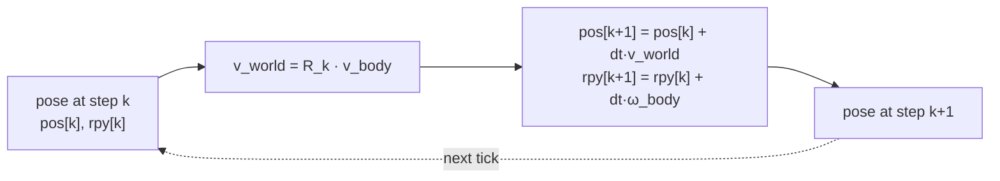

# Pose & Kinematics

Mobile robots / drones: a single rigid body. Adds **time** to geometry — given pose + velocities now, where is it `dt` later? (Arm version: [Forward & Inverse Kinematics](forward-inverse-kinematics.md).)

---

## 1. Pose = state

- **State** = position `(x, y, z)` + orientation. Orientation as rotation matrix, RPY, or **quaternion** (preferred in sim — numerically stable).
- Together = pose `(R, t)`, see [Coordinate Frames & Transforms](../geometry/coordinate-frames.md), [Rotations & Orientation](../geometry/rotations.md).
- **Body frame** (x fwd, y left, z up) moves with the robot; motion = body frame relative to fixed **world frame**.
- Drone state vector: `x = [x, y, z, vx, vy, vz, ψ]ᵀ` → [State-Space Modeling](../autonomy/state-space.md).

---

## 2. Pose + time → motion

Inputs live in the **body frame** (sensors/actuators are there):

- `v_body = [vx, vy, vz]` — body linear velocity.
- `ω_body = [p, q, r]` — roll/pitch/yaw rates.

Map is in world frame, so rotate then integrate each step:

    v_world  = R_k · v_body
    pos[k+1] = pos[k] + dt · v_world
    rpy[k+1] = rpy[k] + dt · ω_body

**Gotcha:** you cannot add a body-frame velocity to a world-frame position without rotating it first.

**Integration error:** Euler integration assumes constant velocity over `dt` — approximate. Larger `dt` → coarser, more drift; smaller `dt` → faithful but costly. Same drift mechanism as IMU dead-reckoning in [Sensors & State Estimation](../autonomy/state-estimation.md); why [Simulation & Digital Twins](../tooling/simulation-digital-twins.md) picks `dt` carefully.

---

## 3. Position / velocity / acceleration

| Quantity | Linear | Angular |
|----------|--------|---------|
| **Position** | x, y, z | orientation / RPY |
| **Velocity** | v = dx/dt | ω = dθ/dt (p, q, r) |
| **Acceleration** | a = dv/dt | α = dω/dt |

Integrate forward to predict; differentiate back to recover rates. §2's `v_body`/`ω_body` are the velocity row in body frame.

---

## 4. Failure modes

| Block | Needs | Failure |
|-------|-------|---------|
| **Perception** | correct world→body→sensor chain | wrong extrinsics → wrong map |
| **Control** | consistent command/feedback frames | mixed frames → unstable commands |
| **Simulation** | integrate over dt | large dt → integration drift |

Throughline: kinematics is only as good as its **frames** and **rotations**.

---

## 5. Worked patterns

**Turning + moving (ground robot).** "Forward 10 m" is a body-frame displacement `[10, 0]`. Rotate by current heading *before* adding: after a 90° left turn, forward = world +y, so end ≈ (0, 10) not (10, 0). Each leg: `pos_new = pos_old + R(heading) · displacement_body`. Skip the rotation → robot mislocates itself.

**Sensor → world.** Walk the chain:

- **Sensor → robot:** `p_robot = R_sensor·p_sensor + t_sensor` (extrinsics: mount offset/rotation).
- **Robot → world:** `p_world = R_robot·p_robot + t_robot` (robot pose).

Full composition `p_world = T_robot · T_sensor · p_sensor`; stop earlier for robot-frame (local avoidance), go full for world-frame ([Planning & Navigation](../autonomy/planning.md)). **Gotcha:** changing heading alone moves where a sensed obstacle lands in the world — the body offset is rotated by orientation.

---

## Related

- [Coordinate Frames & Transforms](../geometry/coordinate-frames.md) — pose as (R, t), SE(3), the world→robot→sensor frame chain.
- [Rotations & Orientation](../geometry/rotations.md) — orientation representations and why body velocity must be rotated into the world.
- [Forward & Inverse Kinematics](forward-inverse-kinematics.md) — the manipulator counterpart: joint motion → end-effector pose.
- [Sensors & State Estimation](../autonomy/state-estimation.md) — integration drift; estimating pose from IMU/GPS/camera.
- [State-Space Modeling](../autonomy/state-space.md) — the drone state vector and how it evolves continuously.
- [Simulation & Digital Twins](../tooling/simulation-digital-twins.md) — why the integration time-step dt controls trajectory fidelity.
- [Control Systems & PID](../autonomy/control-pid.md) — control acts on the estimated pose; mixed frames cause instability.

## Handbook references
- *Robotic Manipulation* — [Basic Pick and Place](https://manipulation.csail.mit.edu/pick.html) · [Spatial Algebra (Appendix A)](https://manipulation.csail.mit.edu/spatial.html)
