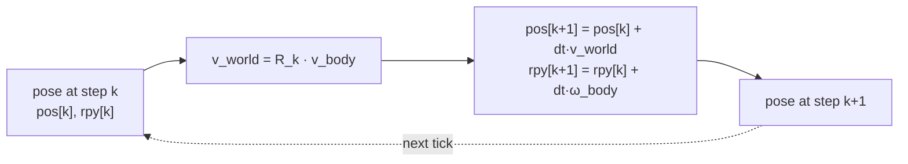

# Pose & Kinematics

**Why this note exists.** This note is about **mobile robots and drones**: bodies that fly or drive through the world as a single rigid frame. [Coordinate Frames & Transforms](../geometry/coordinate-frames.md) gave us *where a body is* (pose, a static snapshot) and [Rotations & Orientation](../geometry/rotations.md) gave us *which way it is turned*. Here we add the missing ingredient — **time** — and answer the question that turns geometry into robotics: given a pose now plus the velocities acting on the body, **where is it an instant later?** That bridge, **pose + time → motion**, is the kinematic core that [Control Systems & PID](../autonomy/control-pid.md), [Sensors & State Estimation](../autonomy/state-estimation.md), and [Simulation & Digital Twins](../tooling/simulation-digital-twins.md) all run on. (The arm/manipulator version — joints and end-effectors — lives in [Forward & Inverse Kinematics](forward-inverse-kinematics.md).)

---

## 1. Pose = position + orientation = state

The **state** of a mobile robot has two parts:

    State = Position + Orientation
    state = (x, y, z, orientation)

**Position** (x, y, z) locates the body in 3D space; **orientation** says how it is rotated, stored as a rotation matrix, RPY angles, or — most commonly in simulation — a **quaternion** for numerical stability (see [Rotations & Orientation](../geometry/rotations.md)). Together they are the **pose** `(R, t)` from [Coordinate Frames & Transforms](../geometry/coordinate-frames.md). Every robot carries its own **body frame** (x forward, y left/lateral, z up) that moves and turns with it; describing motion means describing how this body frame slides and spins relative to the fixed **world frame**.

A typical drone state vector layers velocity on top of pose: `x = [x, y, z, vx, vy, vz, ψ]ᵀ` — the bridge to [State-Space Modeling](../autonomy/state-space.md).

---

## 2. The bridge: pose + time → motion

The robot's "inputs" are most naturally expressed in its **own body frame**, because that is where its sensors and actuators live:

- **Body-frame linear velocity** `v_body = [vx, vy, vz]` — how fast it moves forward/left/up *from its own point of view*.
- **Body-frame angular rates** `ω_body = [p, q, r]` — roll, pitch, yaw rate (spin about the body x/y/z axes).

But the **map** lives in the world frame, so each step we must rotate the body velocity into world coordinates using the current orientation `R_k`, then integrate:

    v_world   = R_k · v_body                 (rotate body velocity into world frame)
    pos[k+1]  = pos[k] + dt · v_world         (integrate linear velocity → position)
    rpy[k+1]  = rpy[k] + dt · ω_body          (integrate angular rates → orientation)

This is **discrete-time kinematics**: take the current pose, push it forward by one small step `dt`, repeat. The rotation step is essential and is exactly why [Rotations & Orientation](../geometry/rotations.md) matters here — *you cannot add a body-frame velocity to a world-frame position without first rotating it.*

### Integration error grows with dt

This update is **numerical integration** (Euler integration), so it is **approximate**. The body really moves along a curve during `dt`, but the update assumes velocity is constant across the whole step. A **larger dt** means a coarser approximation and **more integration error** accumulating each step; a **smaller dt** tracks the true trajectory more faithfully at the cost of more computation. This is the same drift mechanism that plagues dead-reckoning in [Sensors & State Estimation](../autonomy/state-estimation.md) (integrating IMU readings makes position error grow with time) — and it is why [Simulation & Digital Twins](../tooling/simulation-digital-twins.md) must pick `dt` carefully.

---

## 3. Position, velocity, acceleration (linear & angular)

Kinematics describes motion at three levels of derivative, in both translation and rotation:

| Quantity | Linear (Cartesian) | Angular (rotational) |
|----------|--------------------|----------------------|
| **Position** | x, y, z | orientation / RPY angles |
| **Velocity** | v = dx/dt | ω = dθ/dt (rates p, q, r) |
| **Acceleration** | a = dv/dt | α = dω/dt |

Integrating forward (acceleration → velocity → position, and angular acceleration → rates → orientation) **predicts** future motion; differentiating backward recovers rates from a position history. The body-frame inputs `v_body` and `ω_body` of §2 are the velocity row of this table, expressed in the body frame and rotated into the world to advance position and orientation.

---

## 4. Why this matters

Kinematics is the shared substrate beneath three other blocks, and getting it wrong breaks each in a characteristic way:

| Block | What it needs from kinematics | Failure if you get it wrong |
|-------|-------------------------------|------------------------------|
| **Perception** | correct frame chain world→body→sensor | **wrong extrinsics → wrong map** — objects placed in the wrong world location |
| **Control** | consistent frames for commands & feedback | **mixed frames → unstable / incorrect commands** |
| **Simulation** | integrating motion over dt | **larger dt → integration error**, drift between true and simulated path |

These are the same three lessons from the drone-plus-camera handout: perception depends on correct extrinsics, control depends on never mixing body and world frames, and simulation fidelity depends on `dt`. The throughline: kinematics is only as trustworthy as the **frames** ([Coordinate Frames & Transforms](../geometry/coordinate-frames.md)) and **rotations** ([Rotations & Orientation](../geometry/rotations.md)) it is built on.

---

## 5. Worked-example style discussions

### A robot turning and moving

Start a ground robot at position (0, 0) **facing along the world x-axis**. It **turns 90° left** (its body x now points along world +y) and **drives 10 m forward**. The key subtlety: "forward 10 m" is a **body-frame** displacement `[10, 0]`; to find the world displacement you must **rotate it by the robot's current orientation** before adding it to the position — after the 90° left turn, "forward" means world +y, so the robot ends near (0, 10), not (10, 0). Then it **turns 45° right** and **moves 5 m backward**: again the backward step is body-frame, rotated by the *new* heading, then added. Each leg is one application of `pos_new = pos_old + R(heading) · displacement_body` — the discrete update of §2 with `dt·v_world` as the step. Skip the rotation and the robot "thinks" it is somewhere it is not.

### Sensor readings into robot and world frames

Now place the robot at (10, 20), **facing 45° left of the world x-axis**, with a sensor mounted **1 m forward** of the body center and rotated **90° right** relative to the body x-axis. The sensor detects obstacles at points it reports in **sensor coordinates**. To use them, walk the chain from [Coordinate Frames & Transforms](../geometry/coordinate-frames.md):

- **Sensor → robot:** apply the sensor's mounting pose (1 m forward, 90° right) — `p_robot = R_sensor·p_sensor + t_sensor`. This is the extrinsics step, the mobile analog of the drone's camera mount.
- **Robot → world:** apply the robot's pose (position (10,20), heading 45°) — `p_world = R_robot·p_robot + t_robot`.

The result answers two different questions about the same obstacle: its **robot-frame** position (for local obstacle avoidance) and its **world-frame** position (to drop onto the global map for [Planning & Navigation](../autonomy/planning.md)). Both come from the same composition `p_world = T_robot · T_sensor · p_sensor`; the only thing that changes is how far up the chain you stop. As the drone handout warns, **changing the robot's heading alone moves where a sensed obstacle lands in the world**, even if the obstacle and the sensor mount never moved — because the body-frame offset is rotated by the body's orientation.

---

## Related

- [Coordinate Frames & Transforms](../geometry/coordinate-frames.md) — pose as (R, t), SE(3), the world→robot→sensor frame chain.
- [Rotations & Orientation](../geometry/rotations.md) — orientation representations and why body velocity must be rotated into the world.
- [Forward & Inverse Kinematics](forward-inverse-kinematics.md) — the manipulator counterpart: joint motion → end-effector pose.
- [Sensors & State Estimation](../autonomy/state-estimation.md) — integration drift; estimating pose from IMU/GPS/camera.
- [State-Space Modeling](../autonomy/state-space.md) — the drone state vector and how it evolves continuously.
- [Simulation & Digital Twins](../tooling/simulation-digital-twins.md) — why the integration time-step dt controls trajectory fidelity.
- [Control Systems & PID](../autonomy/control-pid.md) — control acts on the estimated pose; mixed frames cause instability.
