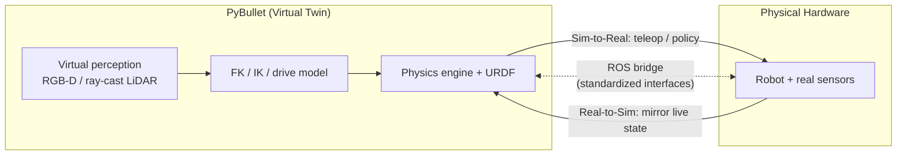

# Simulation & Digital Twins

Modern robot learning has a **bottleneck**: training intelligent agents directly on physical hardware is **slow, dangerous, and data-poor**. Simulation breaks that bottleneck by abstracting reality into a **high-fidelity, computationally efficient virtual environment** where policies can be trained and tested before ever touching a real robot. A **digital twin** is the disciplined form of this idea — a virtual replica kept faithful enough to a specific physical asset that algorithms developed in it transfer back. The hard part is the **Reality Gap**: the residual difference between sim and world that, if ignored, makes a perfectly-trained policy fail catastrophically on hardware.

---

## 1. Why Simulate

| Driver | What simulation provides |
|--------|--------------------------|
| **Safety** | Real robots in domestic/human spaces risk **catastrophic damage** during trial-and-error; human-centric deployment demands safety guarantees *before* going live. Sim lets the agent fail harmlessly. |
| **Hardware cost** | No wear, no breakage, no expensive teardown from exploratory training. |
| **Speed & parallelism** | Physical robots run strictly at **1× real-time**; simulators run **asynchronously** and **parallelise thousands of trials** across compute clusters. |
| **Privileged / ground-truth state** | Physical learning has limited access to accurate state. Simulators supply **"privileged information"** — exact coordinates, velocities, collision states — to **bootstrap learning** (e.g. reinforcement learning rewards). |

**Key takeaway:** to train RL agents at all, we must abstract reality into virtual environments that are simultaneously **accurate** and **cheap to compute** — a tension that defines the whole field.

---

## 2. What a Digital Twin Is

A **digital twin** is a **virtual model replicating the behaviour of an existing (or potential) real-world asset**. It is more than a one-off simulation: it is structured along three dimensions (IoT Analytics catalogues ~210 combinations of them):

- **Lifecycle phase** — Digitize → Visualize → Simulate → Emulate → Extract → Orchestrate → Predict.
- **Hierarchical level** — Information → Component → Product → System → Multi-system.
- **Purpose** — what the twin is *for*:

| Purpose | Meaning |
|---------|---------|
| **System Prediction** | Forecasting **future states** from current data, historical logs, and physics models. |
| **System Simulation** | Testing **"what-if" scenarios** for complex, interlinked variables before physical execution. |
| **Asset Interoperability** | Streamlining **common data formats** for real-time extraction of statuses and sensor measurements. |

A concrete example is **ADAM** (a mobile humanoid for domestic/elderly assistance) paired with **ADAMSim**, a precise PyBullet replication used for **safe, reproducible Sim-to-Real algorithm development** and data collection — a unified test bed for mapping, grasping, and manipulation learning. A twin's value depends on **modularity**: standardized interfaces (navigation, kinematics, perception as swappable modules) let researchers replace one algorithm without breaking the rest.

---

## 3. The Physics Engine Ecosystem

The simulator's heart is its **physics engine**, and choosing one is always a **calculated trade-off between computational speed, visual rendering fidelity, and physical accuracy**.

| Engine | Owner | Core strengths | Trade-offs |
|--------|-------|----------------|------------|
| **MuJoCo** | DeepMind | Exceptional **rigid-body dynamics** and **contact resolution**; high performance. | Steep learning curve; historically awkward API. |
| **PyBullet** | Open source | **Python-native**, loads **URDF/SDF**, huge academic community. | Basic visual rendering vs game engines. |
| **Gazebo** | Open Robotics | Heavy **ROS integration**, standard for **mobile robotics**, excellent sensor simulation. | Computationally heavy for rapid RL training. |
| **IsaacLab** | Nvidia | **Extreme GPU parallelization**, high visual fidelity. | Requires specific high-end hardware. |

**Why PyBullet for research.** It wraps the **Bullet Physics SDK** in a clean **Python API** (bypassing C++ complexity), **natively loads articulated bodies** from URDF/SDF/MJCF, has **built-in solvers for forward/inverse dynamics and forward/inverse kinematics**, and handles rigid-body dynamics, collision detection, and **ray intersection** natively. It is the **ideal bridge** — simple enough for rapid prototyping, robust enough for advanced ML — which is why it underpins twins like ADAMSim.

---

## 4. Anatomy of a Virtual Robot — the URDF

A robot is described to the engine by a **URDF** (Unified Robot Description Format), an articulated tree of links and joints:

| Element | Role |
|---------|------|
| **Links** | The **rigid bodies** (forearm, chassis). |
| **Joints** | **Connections dictating movement**: **revolute** (rotational, limited), **prismatic** (linear/sliding), **fixed** (rigid, no motion). |
| **Visual elements** | Meshes/geometry defining how the robot is **rendered** on screen. |
| **Collision elements** | **Simplified** geometric boundaries the engine uses to **detect impacts** — deliberately coarser than visual meshes for speed. |
| **Inertial properties** | **Mass and centre of gravity**, dictating how forces produce motion. |

The **visual vs collision** split is a deliberate efficiency choice: pretty meshes for display, simple primitives for the contact solver. (Process-aware extensions like *PyBullet Industrial* go beyond the end-effector to model milling/printing forces fed back onto the joints — useful for designing controllers that compensate for large process loads.)

---

## 5. Simulating Movement

- **Differential-drive navigation** — translates desired **linear (v)** and **angular (ω)** velocities into individual **left/right wheel speeds**, factoring in wheel radius **r** and wheel separation **d**. This is the base mobility model for a wheeled robot.
- **Arm & hand kinematics** — **Forward Kinematics (FK)** computes the end-effector pose from joint angles (e.g. via PyKDL wrappers); **Inverse Kinematics (IK)** computes the joint angles needed to reach a target 3D coordinate. Hand actuation maps normalized inputs to the internal motors of the simulated gripper. See [Forward & Inverse Kinematics](../kinematics/forward-inverse-kinematics.md).

The same FK/IK and drive equations that move the *real* robot also move its twin — which is precisely what makes the twin a valid training ground.

---

## 6. Virtual Perception

Simulators must render not just motion but **sensing**, so that a perception stack trained in sim sees the same modalities it will face on hardware (see [Perception](../autonomy/perception.md) and [Sensors & State Estimation](../autonomy/state-estimation.md)):

- **RGB-D cameras** — simulating a RealSense D435i for colour, **depth**, and **segmentation**.
- **2D LiDAR** — simulating a UST-10LX by **ray casting**: shooting virtual rays into the scene and returning the distance to the first intersection, exactly mirroring a real laser scanner's returns.

---

## 7. The ROS Bridge — Real ↔ Sim

A digital twin is connected to its physical counterpart **bidirectionally**, typically over **ROS**, so the two stay in sync and either can drive the other:

- **Real-to-Sim** — **mirroring** the physical robot's live state inside the twin (the sim shadows reality).
- **Sim-to-Real** — **teleoperating** the physical robot directly from PyBullet outputs (the sim drives reality).

---

## 8. The Reality Gap

The **Reality Gap** is the **difference between the simulated environment and physical reality**, caused by the **necessary abstractions, approximations, and unmodeled physics** that make simulation tractable.

**Why it is dangerous.** Machine-learning policies are **highly efficient at exploiting** modeling inaccuracies and simulator-specific corner cases — achieving rewards in **physically impossible ways**. A policy that is a perfect **POMDP** (Partially Observable Markov Decision Process) solution **in PyBullet** will therefore often **fail catastrophically on the physical robot**. The slogan: **never trust a simulator implicitly.**

The gap decomposes into **three pillars**:

| Pillar | Sim assumption (wrong) | Physical reality |
|--------|------------------------|------------------|
| **1. Dynamics modeling** | Perfect **rigid bodies**; clean contact. | Real robots **bend, vibrate, have joint backlash**; **friction (sticking/slipping)** and deformation are highly **non-linear** and hard to compute. |
| **2. Perception & sensing** | **"Too perfect"** sensors. | Real cameras have **motion blur, lens distortion, variable lighting**; real LiDAR/depth suffer **scattered reflections, noise, environmental interference**. |
| **3. Actuation & hardware** | Ideal torque, instant stepping. | **Voltage drops** from battery depletion cut available **joint torque**; **communication latency** in low-level loops adds delays absent in perfectly-stepped sims. |

These map directly onto the integration failure modes in [System Integration & Robustness](../autonomy/integration-robustness.md) — delay, noise, and unmodeled assumptions biting at the interfaces.

---

## 9. Bridging the Gap — Sim-to-Real Transfer

Three complementary techniques close the gap; production systems combine them:

| Technique | Idea |
|-----------|------|
| **Domain randomization** | **Systematically vary** physics and visual parameters in sim — mass, friction, lighting — so the trained policy treats **reality as just another random variation** and generalises across it. |
| **System identification (Sys-ID)** | **Mathematically calibrate** the simulator against **real-world datasets** to make its mass, latency, and friction **exactly match** the physical robot. |
| **Learned residual models** | Train a **neural network to learn the difference** between the imperfect simulator and reality, then apply **corrective forces** to push the sim toward physical accuracy. |

A bonus refinement, **Real-Time Intrinsic Stochasticity (RT-IS)**, uses the **OS clock** for PyBullet timesteps instead of deterministic increments, injecting natural timing noise so the sim is less brittle.

**The lifecycle of robot learning, in one line:** simulation solves the **safety/cost/scalability** bottleneck via **digital twins**; **PyBullet** gives the optimal balance of accessibility, URDF support, and robust physics; **modular architecture** (navigation, kinematics, perception) is **bridged bidirectionally by ROS**; and deployment **always** requires bridging the **Reality Gap** with domain randomization and Sys-ID — never trusting the simulator implicitly.

---

## Related

- [Forward & Inverse Kinematics](../kinematics/forward-inverse-kinematics.md) — FK/IK solvers move both the twin and the real arm; the shared model makes the twin valid.
- [Perception](../autonomy/perception.md) — virtual RGB-D and ray-cast LiDAR feed the same perception stack used on hardware.
- [Sensors & State Estimation](../autonomy/state-estimation.md) — "too perfect" simulated sensors vs real noise/bias is Pillar 2 of the Reality Gap.
- [System Integration & Robustness](../autonomy/integration-robustness.md) — latency, stale data, and saturation are exactly the Reality-Gap failure modes at integration level.
- [Planning & Navigation](../autonomy/planning.md) — differential-drive v/ω → wheel speeds is the mobility model simulated for navigation.
