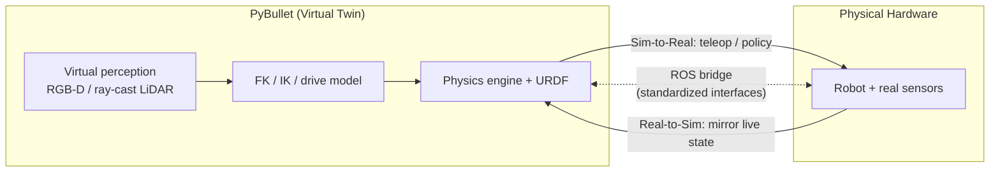

# Simulation & Digital Twins

Training on hardware is slow, dangerous, data-poor. **Simulation** = high-fidelity, cheap virtual environment to train/test policies before touching a robot. A **digital twin** is the disciplined form — a virtual replica kept faithful to a *specific* physical asset so algorithms transfer back. Hard part: the **Reality Gap** — residual sim/world difference that makes a perfect policy fail on hardware.

---

## 1. Why Simulate

| Driver | What it provides |
|--------|------------------|
| **Safety** | Agent fails harmlessly vs catastrophic damage in human spaces. |
| **Hardware cost** | No wear, breakage, teardown. |
| **Speed & parallelism** | Real robots run at 1× real-time; sim runs async, parallelises thousands of trials. |
| **Privileged state** | Exact coords/velocities/collision states to bootstrap learning (e.g. RL rewards). |

Core tension: virtual environments must be simultaneously **accurate** and **cheap to compute**.

---

## 2. What a Digital Twin Is

Virtual model replicating a real (or potential) asset — more than a one-off sim. Structured along three dimensions (~210 combinations):

- **Lifecycle phase** — Digitize → Visualize → Simulate → Emulate → Extract → Orchestrate → Predict.
- **Hierarchical level** — Information → Component → Product → System → Multi-system.
- **Purpose**:

| Purpose | Meaning |
|---------|---------|
| **System Prediction** | Forecast future states from current/historical data + physics. |
| **System Simulation** | Test "what-if" scenarios before physical execution. |
| **Asset Interoperability** | Common data formats for real-time status/measurement extraction. |

Example: **ADAM** (mobile humanoid for domestic/elderly assistance) + **ADAMSim** (PyBullet replica) for safe, reproducible Sim-to-Real dev. Twin value depends on **modularity** — swappable nav/kinematics/perception modules.

---

## 3. Physics Engine Ecosystem

Engine choice = trade-off between **speed, rendering fidelity, physical accuracy**.

| Engine | Owner | Strengths | Trade-offs |
|--------|-------|-----------|------------|
| **MuJoCo** | DeepMind | Excellent rigid-body dynamics + contact; fast. | Steep curve; awkward API. |
| **PyBullet** | Open source | Python-native, loads URDF/SDF, big community. | Basic rendering. |
| **Gazebo** | Open Robotics | Heavy ROS integration; standard for mobile robotics; good sensor sim. | Heavy for rapid RL. |
| **IsaacLab** | Nvidia | Extreme GPU parallelization, high fidelity. | Needs high-end hardware. |

**PyBullet for research:** wraps **Bullet Physics SDK** in clean Python (no C++), loads articulated bodies (URDF/SDF/MJCF), built-in FK/IK + forward/inverse dynamics solvers, rigid-body dynamics, collision, ray intersection. Ideal prototyping/ML bridge — underpins ADAMSim.

---

## 4. The URDF

Robot = articulated tree of links/joints (Unified Robot Description Format).

| Element | Role |
|---------|------|
| **Links** | Rigid bodies (forearm, chassis). |
| **Joints** | Movement: **revolute** (rotational, limited), **prismatic** (sliding), **fixed** (no motion). |
| **Visual** | Meshes for rendering. |
| **Collision** | **Simplified** geometry for impact detection — coarser than visual for speed. |
| **Inertial** | Mass + center of gravity → how forces produce motion. |

**Visual vs collision** split = deliberate efficiency (pretty meshes display, primitives for contact solver). *PyBullet Industrial* extends to milling/printing forces fed back onto joints.

---

## 5. Simulating Movement

- **Differential-drive** — desired linear `v` + angular `ω` → left/right wheel speeds, given wheel radius `r`, separation `d`. Base wheeled mobility model.
- **Arm/hand kinematics** — **FK** (joint angles → end-effector pose, e.g. PyKDL); **IK** (target 3D coord → joint angles); hand maps normalized inputs to gripper motors. See [Forward & Inverse Kinematics](../kinematics/forward-inverse-kinematics.md).

Same FK/IK + drive equations move real robot and twin → makes the twin a valid training ground.

---

## 6. Virtual Perception

Render sensing, not just motion, so a sim-trained stack sees the same modalities on hardware (see [Perception](../autonomy/perception.md), [Sensors & State Estimation](../autonomy/state-estimation.md)):

- **RGB-D cameras** — simulate RealSense D435i (colour, depth, segmentation).
- **2D LiDAR** — simulate UST-10LX via **ray casting** (virtual rays → distance to first intersection).

---

## 7. ROS Bridge — Real ↔ Sim

Twin connected **bidirectionally**, typically over **ROS**:

- **Real-to-Sim** — mirror physical robot's live state in the twin (sim shadows reality).
- **Sim-to-Real** — teleop physical robot from PyBullet outputs (sim drives reality).

---

## 8. The Reality Gap

Difference between sim and physical reality, caused by **necessary abstractions, approximations, unmodeled physics**.

**Why dangerous:** ML policies **exploit modeling inaccuracies** to win rewards in physically-impossible ways. A perfect **POMDP** solution in PyBullet often **fails catastrophically on hardware**. Slogan: **never trust a simulator implicitly.**

Three pillars:

| Pillar | Sim assumption (wrong) | Physical reality |
|--------|------------------------|------------------|
| **1. Dynamics** | Perfect rigid bodies, clean contact. | Robots bend/vibrate, joint backlash; friction (stick/slip) + deformation are non-linear. |
| **2. Perception** | "Too perfect" sensors. | Motion blur, lens distortion, variable lighting; LiDAR/depth scatter, noise, interference. |
| **3. Actuation** | Ideal torque, instant stepping. | Voltage drops cut joint torque; comms latency adds delays absent in stepped sims. |

Map onto integration failure modes in [System Integration & Robustness](../autonomy/integration-robustness.md) — delay, noise, unmodeled assumptions at interfaces.

---

## 9. Bridging the Gap — Sim-to-Real Transfer

Three complementary techniques (production combines them):

| Technique | Idea |
|-----------|------|
| **Domain randomization** | Vary physics/visual params (mass, friction, lighting) so policy treats reality as another variation. |
| **System ID (Sys-ID)** | Calibrate sim against real datasets so mass/latency/friction match exactly. |
| **Learned residual models** | NN learns sim↔reality difference, applies corrective forces. |

Bonus — **RT-IS** (Real-Time Intrinsic Stochasticity): use OS clock for PyBullet timesteps, injecting timing noise to reduce brittleness.

**One line:** sim solves safety/cost/scalability via digital twins; **PyBullet** balances accessibility/URDF/physics; **modular** nav/kinematics/perception bridged bidirectionally by **ROS**; deployment always requires bridging the **Reality Gap** (domain randomization + Sys-ID) — never trust the sim implicitly.

---

## Related

- [Forward & Inverse Kinematics](../kinematics/forward-inverse-kinematics.md) — FK/IK solvers move both the twin and the real arm; the shared model makes the twin valid.
- [Perception](../autonomy/perception.md) — virtual RGB-D and ray-cast LiDAR feed the same perception stack used on hardware.
- [Sensors & State Estimation](../autonomy/state-estimation.md) — "too perfect" simulated sensors vs real noise/bias is Pillar 2 of the Reality Gap.
- [System Integration & Robustness](../autonomy/integration-robustness.md) — latency, stale data, and saturation are exactly the Reality-Gap failure modes at integration level.
- [Planning & Navigation](../autonomy/planning.md) — differential-drive v/ω → wheel speeds is the mobility model simulated for navigation.

## Handbook references
- *Robotic Manipulation* — [Drake (Appendix B)](https://manipulation.csail.mit.edu/drake.html) · [DrakeGym Environments](https://manipulation.csail.mit.edu/environments.html) · [Reinforcement Learning](https://manipulation.csail.mit.edu/rl.html)
- *Underactuated Robotics* — [Drake (Appendix)](https://underactuated.csail.mit.edu/drake.html)
